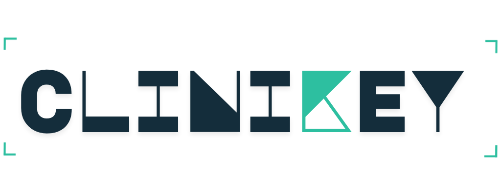
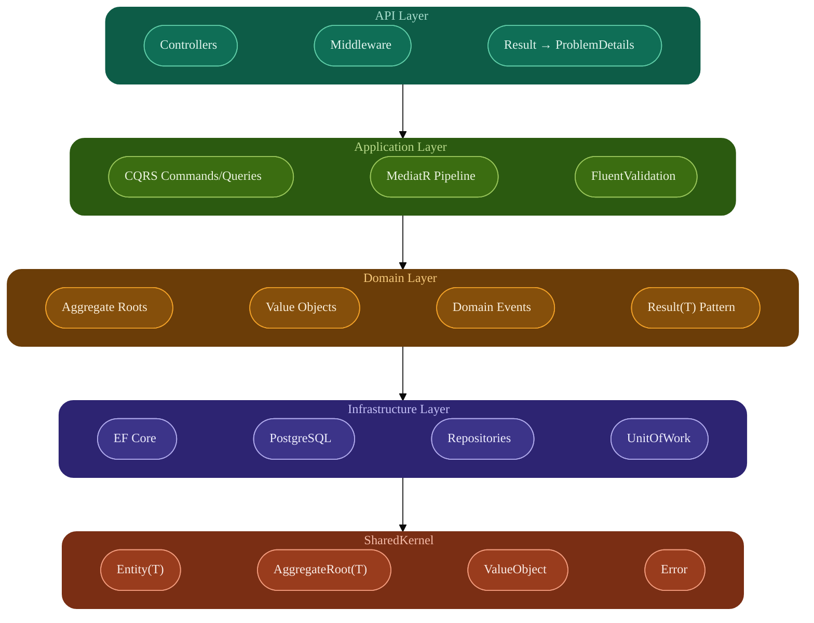
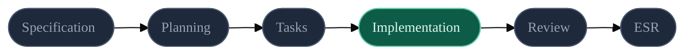

# CliniKey

<p align="center">
  
</p>

<p align="center">
  <strong>Production-Grade Dental Clinic Management SaaS</strong><br/>
  Architected with Domain-Driven Design (DDD), CQRS, and Clean Architecture on .NET 10.
</p>

<p align="center">
  <em>Built with discipline, not deadlines. Every pattern is intentional. Every error is handled.</em>
</p>

<p align="center">
  
  
  
  
  
  
</p>

---

## Overview

CliniKey is a dental clinic management platform built for the Egyptian market. It enforces real DB-level multi-tenancy via PostgreSQL schema-per-tenant, validates FDI tooth codes (ISO 3950), tracks split payments across Cash, Visa, InstaPay, and Fawry with per-line 14% VAT snapshots, and drives clinical workflows through strict state machines — all without a single anemic model or unhandled exception path. Every design choice, from the `Result<T>` pattern to the MediatR pipeline, is optimized for **maintainability**, **auditability**, and **explicit domain logic**.

---

## Architecture



### Layer Responsibilities

```text
src/
├── CliniKey.SharedKernel/     # DDD primitives: Entity<T>, AggregateRoot<T>, Result<T>, Error
├── CliniKey.Domain/           # Pure C# — Business rules, Aggregates, and Value Objects
├── CliniKey.Application/      # CQRS Handlers, Pipeline Behaviors, and DTOs
├── CliniKey.Infrastructure/   # EF Core, PostgreSQL Repositories, and Multi-tenancy
└── CliniKey.API/              # Thin HTTP Adapter — Controllers delegating to MediatR
```

### Core Principles

- **Inward Dependency Flow**: Domain never references Infrastructure. Enforced by project structure.
- **CQRS**: Clean separation of write-side transactions (commands) and read-side performance (Dapper queries).
- **Explicit Aggregate Boundaries**: Encapsulated state transitions with zero "anemic" models.
- **Multi-tenant Isolation**: Every database operation is scoped to the active tenant's PostgreSQL schema. There is no application-level filtering — the wrong schema is structurally unreachable. This is the most security-critical guarantee in the system: a misconfigured query cannot leak data across tenants because the schema boundary makes it architecturally impossible, not just unlikely.

---

## Core Domain Logic

The system models the complete dental clinic lifecycle across five aggregates:


### Domain-Driven Payment Handling

```csharp
public Result RecordPayment(Money amount, PaymentMethod method)
{
    if (Status == InvoiceStatus.Paid)
        return Result.Failure(InvoiceErrors.AlreadyPaid);

    var remaining = CalculateTotal().Value.Amount - CalculatePaidAmount().Value.Amount;

    if (amount.Amount > remaining)
        return Result.Failure(InvoiceErrors.Overpayment);

    _payments.Add(new Payment(amount, method, DateTime.UtcNow));

    Status = CalculatePaidAmount().Value.Amount >= CalculateTotal().Value.Amount
        ? InvoiceStatus.Paid
        : InvoiceStatus.PartiallyPaid;

    MarkUpdated();
    return Result.Success();
}
```

---

## Tech Stack

| Area | Technology |
|------|------------|
| **Runtime** | .NET 10 / C# 13 |
| **Messaging** | MediatR 14.x |
| **Validation** | FluentValidation |
| **ORM / Data** | EF Core + Dapper |
| **Database** | PostgreSQL |
| **Testing** | xUnit / Testcontainers |

---

## Request Pipeline

Every command and query passes through a rigorous, ordered pipeline. Queries bypass the transaction behavior automatically via the `IBaseCommand` marker interface.


---

## Testing

```text
94 Tests • 0 Failures • 0 Build Warnings
```

Tests are organized around three concerns, each with a distinct strategy:

| Concern | Strategy | Tool |
|---------|----------|------|
| **Domain Invariants** | Exhaustive state transition and value object validation | xUnit |
| **Tenant Isolation** | Real PostgreSQL instances verify Tenant A cannot read Tenant B data | Testcontainers |
| **CQRS Handlers** | Unit tests with mocked repositories for use-case orchestration | NSubstitute |

All tests follow the `Method_Scenario_ExpectedResult` naming convention for immediate legibility at a glance:

- `RecordPayment_Overpayment_ReturnsFailure`
- `CheckIn_FromCompleted_ReturnsInvalidTransition`
- `Create_ValidFDICode_ReturnsSuccess`

---

## Development Process

CliniKey follows **Spec-Driven Development (SDD)**. No code is shipped without a specification. Every phase is documented in an **Execution Summary Record (ESR)** — a traceable audit trail of architectural decisions, trade-offs, and build status for each feature shipped.



---

## Project Metrics

| Metric | Value |
|--------|-------|
| **Lines of Code** | ~4,300 |
| **API Endpoints** | 15 |
| **Unit Tests** | 94 |
| **Build Warnings** | 0 |

---

## Getting Started

```bash
# Clone
git clone https://github.com/Bishoy-Mmb/CliniKey.git
cd CliniKey

# Build (expect 0 warnings)
dotnet build CliniKey.slnx

# Run unit tests
dotnet test CliniKey.slnx --filter "Category!=Integration"

# Run all tests (requires Docker)
dotnet test CliniKey.slnx
```

---

## License

This project is for portfolio and educational purposes. All rights reserved.

---

<p align="center">
  <sub>Built with discipline, not deadlines. Every pattern is intentional. Every error is handled.</sub>
</p>