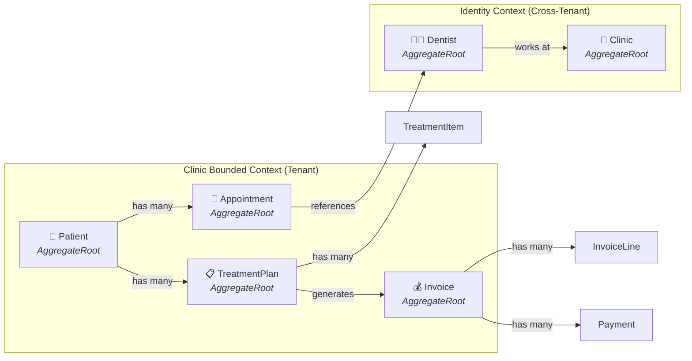
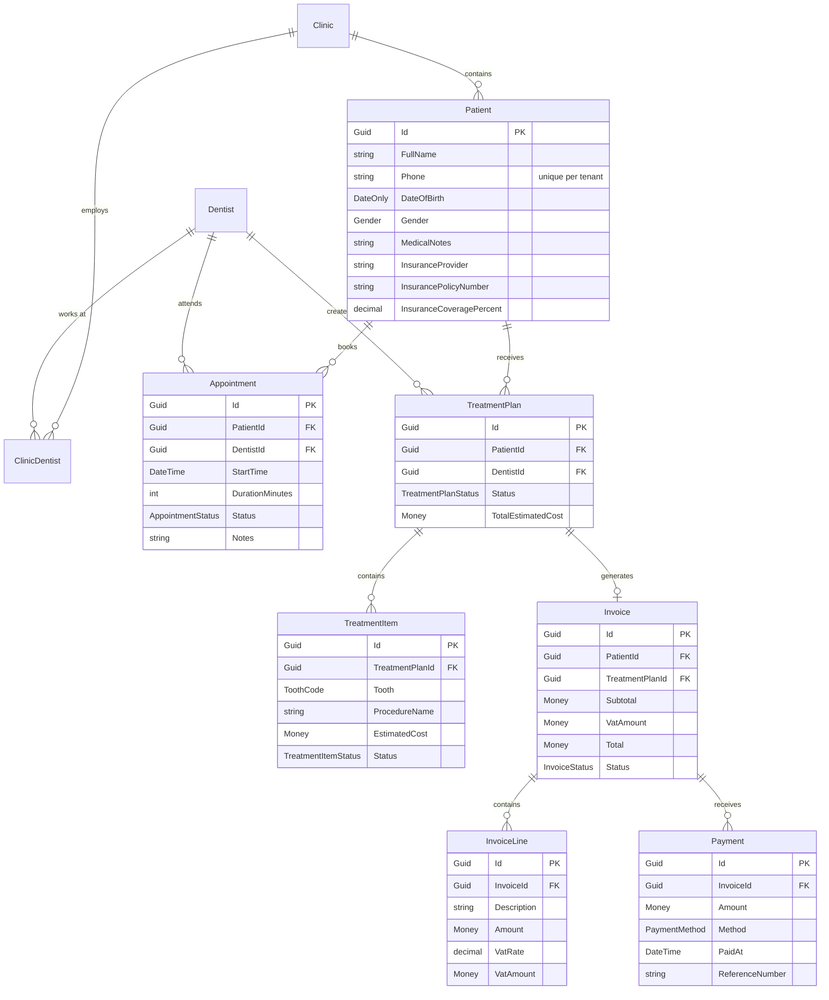

# Phase 2: System Design & Defense

> This document explains **why** every architectural choice was made so you can defend
> the system's design during technical screenings. Read the spec first:
> [specs/001-core-domain-model/spec.md](file:///e:/CliniKey/specs/001-core-domain-model/spec.md)

---

## 1. Aggregate Map

These are your aggregate roots — each is a **consistency boundary** with its own repository,
its own lifecycle, and its own rules. Nothing outside the aggregate can directly mutate its internals.

### Why These Aggregate Boundaries?

| Aggregate | Why it's separate | What would go wrong if merged |
|-----------|-------------------|-------------------------------|
| **Patient** | Core identity entity. Everything references it but nothing shares its transaction. | Merging with Appointment would cause lock contention — every appointment booking would lock the patient row. |
| **Appointment** | Lifecycle (Scheduled→Completed) is independent of patient and treatment. Needs its own concurrency control for slot conflicts. | Merging with Patient would make patient queries drag in all appointment history. |
| **TreatmentPlan** | A plan has internal consistency (items must sum correctly, all teeth must be valid FDI). Created by a dentist, approved by a patient — different actors, different timing. | Merging with Appointment would couple scheduling with clinical workflow — a receptionist shouldn't need access to treatment data. |
| **Invoice** | Financial audit trail. Once issued, an invoice is immutable (you void and reissue, never edit). Completely different lifecycle from treatments. | Merging with TreatmentPlan would mean treatment edits could accidentally mutate financial records. |
| **Dentist** | Cross-tenant entity. A dentist works at multiple clinics. Lives in the Identity context. | If tenant-scoped, you'd duplicate dentist records across clinics and lose the ability to track a dentist's cross-clinic schedule. |

---

## 2. Entity Relationship Diagram

---

## 3. Architectural Decisions & Defense

### 3.1 Why Clean Architecture?

**The problem it solves**: In a capstone project, you need to demonstrate that your domain logic is framework-independent. If tomorrow PostgreSQL is replaced with MongoDB, or ASP.NET is replaced with gRPC — your domain and application layers don't change. Only Infrastructure swaps out.

**How it works in CliniKey**:
- **Domain** knows nothing about databases or HTTP. A `Patient.Create()` method works the same whether called from a REST endpoint, a console app, or a unit test.
- **Application** knows nothing about *which* database. It depends on `IPatientRepository` — an interface in Domain. The concrete implementation lives in Infrastructure.
- **Infrastructure** implements all the interfaces. It's the only layer that knows about EF Core, PostgreSQL, and ASP.NET Identity.
- **API** is a thin adapter that maps HTTP requests to MediatR commands and maps Results back to HTTP responses.

**Screening answer**: *"I chose Clean Architecture because it enforces the Dependency Inversion Principle at the project level. My domain logic has zero coupling to any framework, which means I can test it without a database, swap infrastructure providers without touching business rules, and onboard new developers who can understand the domain without knowing EF Core."*

### 3.2 Why CQRS (Command Query Responsibility Segregation)?

**The problem it solves**: Read and write patterns are fundamentally different in a dental clinic system. A receptionist listing today's appointments needs a fast, denormalized read. A dentist approving a treatment plan needs a transactional write with validation, events, and audit trails.

**How it works in CliniKey**:
- **Commands** (`CreatePatientCommand`) go through the full pipeline: validation → handler → repository → UnitOfWork → domain events.
- **Queries** (`GetPatientByIdQuery`) can bypass the repository entirely and use Dapper for optimized reads with `AsNoTracking`.
- MediatR's pipeline behaviors (`ValidationBehavior`, `LoggingBehavior`, `TransactionBehavior`) apply cross-cutting concerns without cluttering handler code.

**Screening answer**: *"CQRS lets me optimize reads and writes independently. My write side goes through rich domain objects with invariant checking and event dispatch. My read side can use raw SQL via Dapper when I need complex joins or projections, without compromising domain integrity. MediatR gives me a pipeline where I can plug in validation, logging, and transaction management as behaviors — it's the Open/Closed Principle in action."*

### 3.3 Why the Result Pattern Over Exceptions?

**The problem it solves**: In a dental clinic, a "patient with duplicate phone number" is not an *exception* — it's a perfectly normal business outcome. Using exceptions for expected failures makes error paths invisible and forces callers to guess what might throw.

**How it works in CliniKey**:
- Every command handler returns `Result` or `Result<T>`. The caller *must* check `IsSuccess` before accessing the value.
- Errors are structured records with a `Code` (for programmatic handling) and `Description` (for humans).
- The controller maps `Result.Failure` to RFC 7807 `ProblemDetails` — the HTTP standard for error responses.
- Actual exceptions (database down, null reference) are caught only at the middleware boundary and return generic 500s.

**Screening answer**: *"I use the Result pattern because it makes error handling explicit and forces every consumer to handle both paths. My domain methods return `Result<T>` — there's no way to accidentally ignore a business rule failure. This is the railway-oriented programming pattern from functional programming, adapted for C#. Exceptions are reserved for truly exceptional situations like infrastructure failures."*

### 3.4 Why Schema-per-Tenant Multi-Tenancy?

**The problem it solves**: Egyptian dental clinics handle patient health data. If Clinic A's receptionist can accidentally query Clinic B's patients, that's a data breach. You need physical isolation that's enforceable at the database level, not just in application code.

**How it works in CliniKey**:
- Each clinic gets its own PostgreSQL schema (e.g., `clinic_001`, `clinic_002`).
- Middleware resolves the tenant from the JWT claim or `X-Tenant-Id` header.
- `AppDbContext.OnConfiguring` sets `SET search_path TO '{tenantSchema}'` before any query.
- EF migrations run per-schema during tenant provisioning.

**Three strategies compared**:

| Strategy | Isolation | Complexity | Cost | CliniKey Choice |
|----------|-----------|-----------|------|-----------------|
| Shared table + TenantId column | Low (app-level filter) | Low | Low | ❌ One missed WHERE clause = data leak |
| Schema-per-tenant | High (DB-level) | Medium | Medium | ✅ **This one** |
| Database-per-tenant | Highest | High | High | ❌ Overkill for our scale |

**Screening answer**: *"Schema-per-tenant gives me database-level isolation without the operational overhead of managing hundreds of databases. If a developer forgets a tenant filter, PostgreSQL's `search_path` means they literally can't see another tenant's tables. It's defense-in-depth — the application code filters by tenant, AND the database enforces it structurally."*

### 3.5 Why Domain Events?

**The problem it solves**: When a treatment plan is approved, several things need to happen: the status changes, an invoice might be drafted, a notification might be sent, and an audit log entry is created. If all of this lives in one method, you get a God method that violates SRP.

**How it works in CliniKey**:
- The aggregate raises events: `patient.RaiseDomainEvent(new PatientCreatedEvent(patient.Id))`.
- Events are collected on the entity and dispatched *after* `SaveChangesAsync` succeeds.
- MediatR's `INotificationHandler<T>` handles each side effect in its own class.
- Side effects can be async (notifications) or sync (audit logging).

**Screening answer**: *"Domain events decouple the 'what happened' from the 'what should happen next.' When a `TreatmentPlanApprovedEvent` fires, the treatment plan aggregate doesn't need to know about invoicing, notifications, or auditing. Each handler is independently testable, independently deployable, and follows the Single Responsibility Principle."*

---

## 4. Value Objects — Why They Matter

Value objects aren't just "data holders with equality." They are **self-validating, immutable domain concepts** that prevent invalid state from ever existing in memory.

| Value Object | What it protects | Invalid example it prevents |
|-------------|-----------------|----------------------------|
| `Money(Amount, Currency)` | No negative amounts, currency is always explicit | `new Invoice { Total = -500 }` — impossible |
| `PhoneNumber(Value)` | Egyptian format validation (11 digits, starts with 01) | `patient.Phone = "abc"` — impossible |
| `ToothCode(Value)` | FDI standard (11-48 permanent, 51-85 deciduous) | `tooth = "99"` — impossible |
| `PatientName(First, Last)` | Non-empty, reasonable length | `name = ""` — impossible |
| `LocalizedString(En, Ar)` | At least English value present | `label = new LocalizedString(null, null)` — impossible |

---

## 5. Technical Screening Q&A

### Q1: "Why not just use a monolith with MVC and EF directly?"

> I could, and for a simple CRUD app that's fine. But CliniKey is a multi-tenant SaaS with clinical workflows, financial auditing, and role-based access. Clean Architecture gives me testable layers, CQRS gives me independent optimization of reads and writes, and the Result pattern gives me explicit error handling. These patterns pay for themselves the moment you have more than one bounded context or more than one developer.

### Q2: "Isn't Clean Architecture over-engineering for a portfolio project?"

> It would be over-engineering if I added it without understanding it. The point of this project is to demonstrate I *can* architect at scale. The layering is strict but simple — 5 projects with unidirectional dependencies. Each layer has a clear reason to exist: Domain for business rules, Application for orchestration, Infrastructure for I/O, API for HTTP, SharedKernel for cross-cutting primitives.

### Q3: "How do you prevent N+1 queries?"

> Two ways. For write operations, I use `Include()` to eagerly load child entities within the aggregate boundary. For read operations, I bypass EF entirely and use Dapper with hand-written SQL joins in my query handlers. The CQRS split makes this natural — writes go through rich domain objects, reads go through optimized projections.

### Q4: "What happens if two receptionists book the same slot simultaneously?"

> Optimistic concurrency. The `Appointment` entity has a concurrency token on the time slot. If two requests try to create overlapping appointments, the second `SaveChangesAsync` will throw a `DbUpdateConcurrencyException`, which the handler catches and converts to `Result.Failure(AppointmentErrors.TimeConflict)`. The client gets a 409 Conflict.

### Q5: "Why MediatR instead of just injecting services?"

> MediatR gives me three things for free: (1) a pipeline where I can plug in cross-cutting concerns like validation and logging without modifying handlers, (2) decoupled event dispatch for domain events, and (3) a natural CQRS structure where commands and queries are first-class objects that can be logged, retried, and audited. Direct service injection would work but would require me to manually wire cross-cutting concerns into every service method.

### Q6: "How do you handle the 14% VAT rate changing?"

> VAT rate is stored per invoice line at creation time, not referenced from a config. If the government changes the rate to 15%, all new invoices use 15% and all existing invoices keep 14%. This is standard financial audit practice — you never retroactively change a posted invoice.

### Q7: "Why separate SharedKernel from Domain?"

> SharedKernel contains DDD primitives (`Entity`, `ValueObject`, `Result`, `Error`) that are reusable across any bounded context. If tomorrow I add a "Subscription" bounded context for SaaS billing, it reuses the same base classes without depending on the dental domain. Domain contains dental-specific business logic. They serve different audiences.

### Q8: "How does your multi-tenancy handle a dentist working at two clinics?"

> Dentist lives in the Identity context, which is cross-tenant. A `ClinicDentist` join entity in each tenant's schema links the dentist to that clinic. The dentist's identity (name, license number) is stored once; their clinic-specific data (schedule, permissions) is per-tenant. This avoids data duplication while maintaining tenant isolation.

### Q9: "What's your testing strategy for tenant isolation?"

> Integration tests use Testcontainers to spin up a real PostgreSQL instance. I create two tenants (two schemas), seed data in both, then assert that a query executing in Tenant A's context returns zero rows from Tenant B. This is an explicit test, not an assumption.

### Q10: "Why did you choose Spec-Driven Development?"

> Because this project needs to demonstrate engineering process, not just code output. Every feature starts as a spec — what and why — before any code is written. This means I can hand someone my `specs/` directory and they understand the entire system without reading a line of C#. It also means my AI coding agent generates code from structured specifications rather than ad-hoc prompts, which produces more consistent, maintainable output.

---

## 6. What's Next

With the constitution, spec, and architectural defense in place, the next SDD steps are:

1. **`/speckit.plan`** — Create the technical implementation plan (data model, API contracts, migration strategy)
2. **`/speckit.tasks`** — Break the plan into ordered, implementable tasks
3. **`/speckit.implement`** — Execute tasks to generate the domain entities, repositories, handlers, and controllers

**Awaiting your approval to proceed to `/speckit.plan`.**
