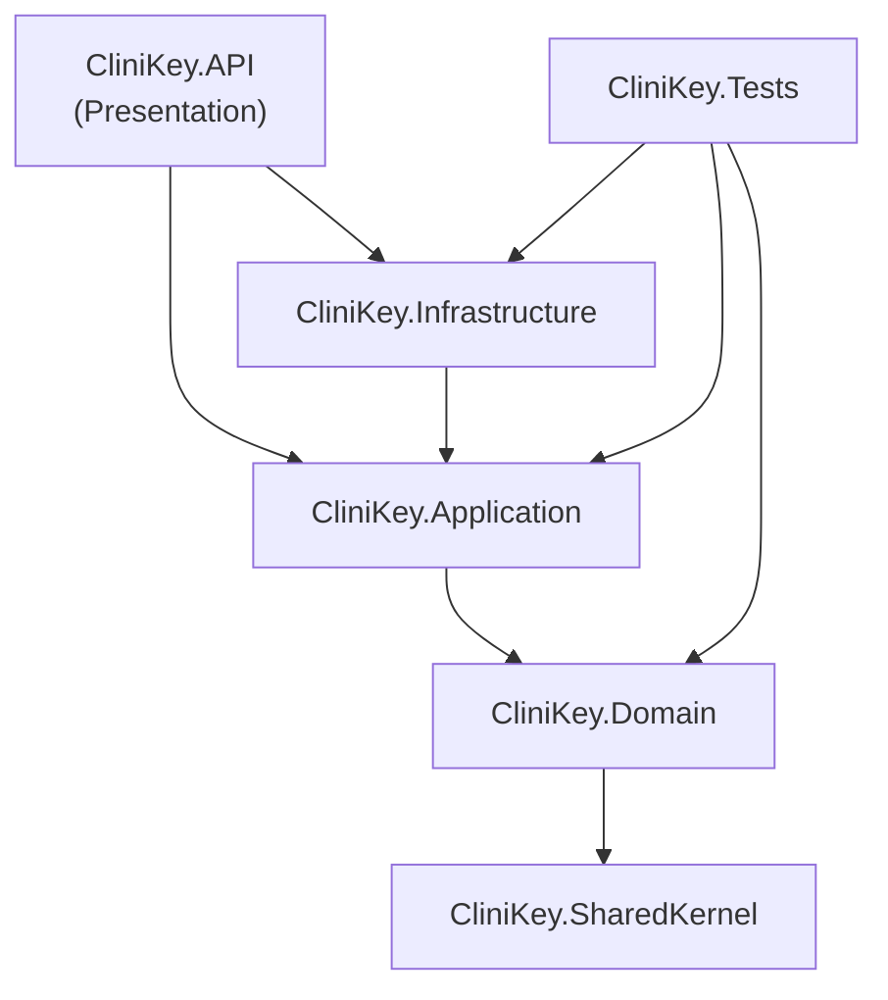

# Phase 1: Execution & Environment Setup — Complete ✅

## What Was Executed

### 1. Git Repository
```
git init → Initialized empty Git repository in E:/CliniKey/.git/
```

### 2. SpecKit Installation
```
pip install pipx              → pipx 1.11.1 installed
pipx install specify-cli      → specify-cli 0.8.3.dev0 installed (specify.exe available)
pipx ensurepath               → C:\Users\PC\.local\bin added to PATH
```
> [!NOTE]
> SpecKit (`specify.exe`) is ready. You'll need to open a new terminal for PATH changes to take effect.

### 3. .NET Solution Scaffolded (from absolute scratch)

| Command | Result |
|---|---|
| `dotnet new sln -n CliniKey` | Created `CliniKey.slnx` (.NET 10 format) |
| `dotnet new classlib -n CliniKey.SharedKernel` | Cross-cutting primitives (Entity, ValueObject, Result, Error) |
| `dotnet new classlib -n CliniKey.Domain` | Domain models, events, repository contracts |
| `dotnet new classlib -n CliniKey.Application` | CQRS handlers, DTOs, pipeline behaviors |
| `dotnet new classlib -n CliniKey.Infrastructure` | EF Core, Identity, external services |
| `dotnet new webapi -n CliniKey.API` | ASP.NET Core 10 Web API entry point |
| `dotnet new xunit -n CliniKey.Tests` | xUnit test project |

### 4. Dependency Graph Wired



### 5. SharedKernel Primitives Created

| File | Purpose |
|---|---|
| `Entity<TId>` | Generic identity-equality base with domain event collection |
| `AggregateRoot<TId>` | Consistency boundary marker with audit timestamps |
| `ValueObject` | Structural equality base for immutable domain concepts |
| `IDomainEvent` | Extends MediatR `INotification` for decoupled event dispatch |
| `Result` / `Result<T>` | Railway-oriented error handling (no exceptions for business logic) |
| `Error` | Structured error record with factory methods (NotFound, Validation, Conflict) |

### 6. NuGet Packages
- **MediatR 14.1.0** → SharedKernel (domain event contract)

### 7. Internal Folder Structure

```
e:\CliniKey\
├── CliniKey.slnx
├── .gitignore
├── docs/
├── src/
│   ├── CliniKey.SharedKernel/
│   │   ├── Primitives/     ← Entity, AggregateRoot, ValueObject, Result, Error, IDomainEvent
│   │   ├── Interfaces/
│   │   └── Enums/
│   ├── CliniKey.Domain/
│   │   ├── Entities/
│   │   ├── ValueObjects/
│   │   ├── Enums/
│   │   ├── Events/
│   │   ├── Repositories/
│   │   └── Errors/
│   ├── CliniKey.Application/
│   │   ├── Abstractions/
│   │   ├── Features/
│   │   ├── DTOs/
│   │   └── Behaviors/
│   ├── CliniKey.Infrastructure/
│   │   ├── Persistence/
│   │   │   ├── Configurations/
│   │   │   └── Repositories/
│   │   ├── Identity/
│   │   ├── Services/
│   │   └── Localization/
│   └── CliniKey.API/
│       ├── Controllers/
│       ├── Middleware/
│       └── Filters/
└── tests/
    └── CliniKey.Tests/
```

### 8. Build Verification
```
dotnet build CliniKey.slnx → Build succeeded. 0 Warning(s). 0 Error(s).
```

### 9. Initial Commit
```
git commit → [master 8c57a27] chore: scaffold CliniKey solution with Clean Architecture layers
             20 files changed, 401 insertions(+)
```

---

## Environment Summary

| Component | Version |
|---|---|
| .NET SDK | **10.0.202** |
| Runtime Target | `net10.0` |
| MediatR | 14.1.0 |
| SpecKit (specify-cli) | 0.8.3.dev0 |
| Python | 3.13.9 |
| Solution Format | `.slnx` (new XML format) |

---

> [!IMPORTANT]
> **Phase 1 is complete.** The environment is scaffolded, built, and committed. Awaiting your approval to proceed to **Phase 2: System Design & Defense** — where I'll outline the core domain models, explain architectural choices, and prepare you for technical screening questions.
