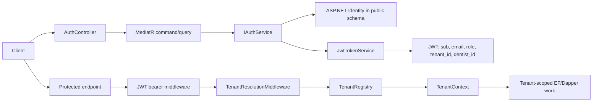

# Learning Journey: Identity & Authentication

This folder is a guided engineering walkthrough for feature `002-identity-auth`.
It teaches how CliniKey moved from open or header-scoped API access to a real
identity boundary: ASP.NET Identity users, signed JWTs, refresh token rotation,
role policies, and tenant-aware request resolution.

## How To Use This Folder

Read these documents in order:

1. [README.md](./README.md): the feature map, mental model, and study rhythm.
2. [architecture-walkthrough.md](./architecture-walkthrough.md): the deeper technical explanation.
3. [code-reading-guide.md](./code-reading-guide.md): a practical sequence for reading the important files.

The goal is to understand the production pressure behind the code: why Identity
is separate from tenant data, why claims matter, why refresh tokens are stored,
and why authorization belongs at API boundaries instead of inside random handlers.

## The Feature In One Sentence

Identity and authentication lets clinic staff register or be invited, log in with
email and password, receive signed tenant-aware JWTs, refresh tokens safely, and
access only the API workflows their role and tenant allow.

## Why This Feels Different From Tutorial Projects

In a tutorial, authentication often means "generate a token after login." In this
project, authentication is also a tenant isolation boundary and a security control
for clinical data.

| Tutorial shortcut | Production pressure in CliniKey |
| --- | --- |
| Put users beside app tables | Auth data must stay in `public` and not move with tenant search paths |
| Trust a tenant header | Tenant identity must come from signed JWT claims |
| Use one admin role string everywhere | Access rules need named policies and reviewable role constants |
| Store refresh tokens plainly or in memory | Refresh tokens must be hashed, persisted, rotated, and replay-aware |
| Let controllers decide error shapes | Expected failures should return `Result<T>` and map through shared API extensions |

The feature spans Application, Infrastructure, API, and tests because each layer
owns a different kind of risk.

## The Mental Model

Think of the feature as two related boundaries:

1. The identity boundary answers "who is this user and what role do they have?"
2. The tenant boundary answers "which clinic context is this request allowed to use?"

The JWT is the handoff between those boundaries. Once issued, it carries the
minimum signed facts the API needs: user id, email, role, tenant id, and optionally
dentist id.

## Key Architecture Shape

| Area | Important files | What they teach |
| --- | --- | --- |
| Spec intent | [spec.md](../../specs/002-identity-auth/spec.md), [plan.md](../../specs/002-identity-auth/plan.md), [tasks.md](../../specs/002-identity-auth/tasks.md) | User stories, intended endpoints, and delivery phases |
| Application contracts | [IAuthService.cs](../../src/CliniKey.Application/Abstractions/Identity/IAuthService.cs), [IJwtTokenService.cs](../../src/CliniKey.Application/Abstractions/Identity/IJwtTokenService.cs), [ICurrentUserService.cs](../../src/CliniKey.Application/Abstractions/Identity/ICurrentUserService.cs) | Clean Architecture boundary: Application asks for identity behavior without owning Identity |
| Auth use cases | [RegisterCommandHandler.cs](../../src/CliniKey.Application/Features/Auth/Commands/Register/RegisterCommandHandler.cs), [LoginCommandHandler.cs](../../src/CliniKey.Application/Features/Auth/Commands/Login/LoginCommandHandler.cs), [InviteStaffCommandHandler.cs](../../src/CliniKey.Application/Features/Auth/Commands/InviteStaff/InviteStaffCommandHandler.cs), [RefreshTokenCommandHandler.cs](../../src/CliniKey.Application/Features/Auth/Commands/RefreshToken/RefreshTokenCommandHandler.cs) | MediatR slices stay thin and delegate identity mechanics |
| Identity infrastructure | [ApplicationUser.cs](../../src/CliniKey.Infrastructure/Identity/ApplicationUser.cs), [AuthDbContext.cs](../../src/CliniKey.Infrastructure/Identity/AuthDbContext.cs), [AuthService.cs](../../src/CliniKey.Infrastructure/Identity/AuthService.cs), [JwtTokenService.cs](../../src/CliniKey.Infrastructure/Identity/JwtTokenService.cs), [RefreshToken.cs](../../src/CliniKey.Infrastructure/Identity/RefreshToken.cs) | ASP.NET Identity, JWT creation, refresh token storage, and role assignment |
| API boundary | [Program.cs](../../src/CliniKey.API/Program.cs), [AuthController.cs](../../src/CliniKey.API/Controllers/AuthController.cs), [TenantResolutionMiddleware.cs](../../src/CliniKey.API/Middleware/TenantResolutionMiddleware.cs) | Authentication pipeline, authorization policies, tenant claim resolution, and HTTP response entry points |
| Tests | [JwtTokenServiceTests.cs](../../tests/CliniKey.Tests/Auth/JwtTokenServiceTests.cs), [CurrentUserServiceTests.cs](../../tests/CliniKey.Tests/Auth/CurrentUserServiceTests.cs), [TenantResolutionMiddlewareTests.cs](../../tests/CliniKey.Tests/API/TenantResolutionMiddlewareTests.cs), [CrossTenantDentistQueryTests.cs](../../tests/CliniKey.Tests/Infrastructure/CrossTenantDentistQueryTests.cs) | Claims, token shape, middleware behavior, and shared dentist persistence under tenant search paths |

## What Was Delivered

The feature delivered:

- ASP.NET Identity backed by [AuthDbContext.cs](../../src/CliniKey.Infrastructure/Identity/AuthDbContext.cs) in the `public` schema.
- `ApplicationUser` fields for tenant id, dentist id, active state, full name, and creation time.
- JWT access tokens from [JwtTokenService.cs](../../src/CliniKey.Infrastructure/Identity/JwtTokenService.cs) with role and tenant claims.
- Refresh tokens stored as SHA-256 hashes with family rotation in [AuthService.cs](../../src/CliniKey.Infrastructure/Identity/AuthService.cs).
- Registration, login, invite, refresh, current-user, and user-by-id API routes in [AuthController.cs](../../src/CliniKey.API/Controllers/AuthController.cs).
- Named authorization policies registered in [Program.cs](../../src/CliniKey.API/Program.cs).
- Tenant resolution from the signed `tenant_id` claim in [TenantResolutionMiddleware.cs](../../src/CliniKey.API/Middleware/TenantResolutionMiddleware.cs).
- Tests around command delegation, token claims, current-user extraction, tenant middleware, and shared dentist writes.

## Remaining Verification Or Known Gaps

[tasks.md](../../specs/002-identity-auth/tasks.md) records `dotnet build CliniKey.slnx`
and `dotnet test` as completed for the feature. This learning-journey update did
not re-run the full suite; it only documents the current code.

There are also a few places to re-check before treating the 002 spec as perfectly
aligned with the current branch:

- [contracts/staff.md](../../specs/002-identity-auth/contracts/staff.md) describes `POST /api/v1/staff/invite`, while the current controller exposes [AuthController.cs](../../src/CliniKey.API/Controllers/AuthController.cs) at `POST /api/v1/auth/invite`.
- [spec.md](../../specs/002-identity-auth/spec.md) describes anonymous admin registration, but [AuthController.cs](../../src/CliniKey.API/Controllers/AuthController.cs) has controller-level `[Authorize]` and the `Register` action is not marked `[AllowAnonymous]`.
- [TenantResolutionMiddleware.cs](../../src/CliniKey.API/Middleware/TenantResolutionMiddleware.cs) skips login and refresh, but not register. That may be intentional after tenant provisioning, or it may need an explicit decision.
- Command handler tests mostly prove delegation to [IAuthService.cs](../../src/CliniKey.Application/Abstractions/Identity/IAuthService.cs). The deeper security behavior lives in [AuthService.cs](../../src/CliniKey.Infrastructure/Identity/AuthService.cs), so future work should add more direct service/integration coverage.

## Commit Story

The git history shows the feature landing in a readable stack:

| Commit theme | Why it matters |
| --- | --- |
| Spec and plan artifacts | Captured the target behavior before code |
| Foundational Identity infrastructure | Introduced users, roles, contexts, settings, and abstractions |
| Register and login | Built the minimum identity loop |
| Endpoint security and tenant claim resolution | Turned auth from login-only into API protection |
| Staff invitation and refresh tokens | Added operational clinic workflows and long-lived sessions |
| Hardening fixes | Moved toward policy-based auth, safer role assignment, and better timestamps |

That stack is useful when studying the feature because it mirrors the dependency
order: infrastructure first, login loop second, authorization third, hardening last.

## Senior Engineer Takeaways

1. Auth data and tenant data are deliberately separate.
   Identity must be reachable before a request has a tenant context, so it belongs
   in the `public` schema via [AuthDbContext.cs](../../src/CliniKey.Infrastructure/Identity/AuthDbContext.cs).

2. JWT claims are not decoration.
   The `tenant_id` claim is the bridge from authentication into tenant isolation.

3. Refresh tokens are security state.
   Access tokens can be stateless; refresh tokens need persistence so the server
   can rotate, revoke, and detect replay.

4. Policies read better than scattered role strings.
   [Policies.cs](../../src/CliniKey.Application/Constants/Policies.cs) and [Roles.cs](../../src/CliniKey.Application/Constants/Roles.cs) make authorization reviewable.

5. A thin handler can be good, but only if the service behind it is well tested.
   The current handlers are intentionally small; the next confidence step is
   deeper coverage around [AuthService.cs](../../src/CliniKey.Infrastructure/Identity/AuthService.cs).

## Suggested Study Rhythm

Start broad, then follow the runtime flow:

1. Read [spec.md](../../specs/002-identity-auth/spec.md), [plan.md](../../specs/002-identity-auth/plan.md), and this README.
2. Read [Program.cs](../../src/CliniKey.API/Program.cs) to understand the pipeline and policies.
3. Read [AuthController.cs](../../src/CliniKey.API/Controllers/AuthController.cs) to see the HTTP surface.
4. Read [IAuthService.cs](../../src/CliniKey.Application/Abstractions/Identity/IAuthService.cs) and the command handlers under [Commands](../../src/CliniKey.Application/Features/Auth/Commands).
5. Read [AuthService.cs](../../src/CliniKey.Infrastructure/Identity/AuthService.cs), [JwtTokenService.cs](../../src/CliniKey.Infrastructure/Identity/JwtTokenService.cs), and [RefreshToken.cs](../../src/CliniKey.Infrastructure/Identity/RefreshToken.cs).
6. Read [TenantResolutionMiddleware.cs](../../src/CliniKey.API/Middleware/TenantResolutionMiddleware.cs) as the bridge from auth into tenancy.
7. Finish with [JwtTokenServiceTests.cs](../../tests/CliniKey.Tests/Auth/JwtTokenServiceTests.cs), [CurrentUserServiceTests.cs](../../tests/CliniKey.Tests/Auth/CurrentUserServiceTests.cs), and [TenantResolutionMiddlewareTests.cs](../../tests/CliniKey.Tests/API/TenantResolutionMiddlewareTests.cs).

Then move into the deeper walkthrough:

- [architecture-walkthrough.md](./architecture-walkthrough.md)

And use the study exercises:

- [code-reading-guide.md](./code-reading-guide.md)
