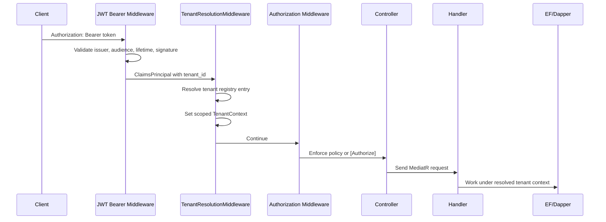
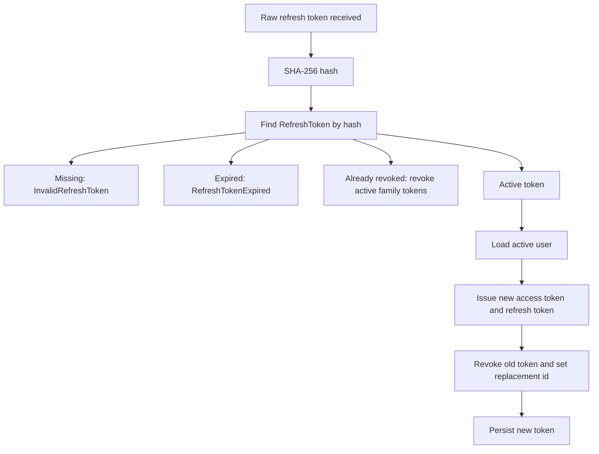

# Architecture Walkthrough: Identity & Authentication

This walkthrough explains feature `002-identity-auth` as a production system,
not just a login endpoint. The important lesson is that authentication, role
authorization, and tenant isolation are connected parts of the same safety story.

## Business Problem

CliniKey is a dental SaaS. That means the API cannot merely know that a caller is
"a user." It must know:

- which clinic the user belongs to,
- whether the user is active,
- whether the clinic is active,
- which staff role the user has,
- whether the user is a dentist with a domain dentist record,
- whether the request is operating inside the correct tenant context.

Feature 002 introduced the identity layer that makes those answers available to
the rest of the API.

## Main Design Choices

| Choice | Why it was made | Cost |
| --- | --- | --- |
| ASP.NET Identity | Avoids custom password hashing, role storage, and user management | Infrastructure depends on Identity types |
| Separate `AuthDbContext` | Identity must live in `public`, outside tenant search-path switching | Two persistence contexts must be configured and migrated |
| JWT access tokens | Fast stateless request authentication | Claims are stale until token expiry |
| DB-backed refresh tokens | Supports rotation, replay detection, restart safety, and multi-instance deployments | Requires server-side token persistence |
| Named policies | Makes authorization rules reviewable in one place | Requires policy maintenance as workflows grow |
| Tenant id in JWT | Replaces spoofable `X-Tenant-Id` with a signed tenant claim | Token issuance must be correct because tenant resolution trusts the claim |

The feature intentionally keeps Identity mechanics in Infrastructure while the
Application layer owns abstractions and MediatR use-case shapes.

## Runtime Request Flow

For a protected endpoint, the pipeline in [Program.cs](../../src/CliniKey.API/Program.cs)
is the key file:

Order matters. `UseAuthentication()` must run before
[TenantResolutionMiddleware.cs](../../src/CliniKey.API/Middleware/TenantResolutionMiddleware.cs),
because tenant resolution reads claims from `HttpContext.User`. `UseAuthorization()`
runs after tenant resolution so protected app endpoints have both identity and
tenant context available.

## Login Flow

Login begins at [AuthController.cs](../../src/CliniKey.API/Controllers/AuthController.cs)
and flows through [LoginCommandHandler.cs](../../src/CliniKey.Application/Features/Auth/Commands/Login/LoginCommandHandler.cs)
into [AuthService.cs](../../src/CliniKey.Infrastructure/Identity/AuthService.cs).

The service does the real work:

1. Look up the user by email through `UserManager<ApplicationUser>`.
2. Return [AuthErrors.InvalidCredentials](../../src/CliniKey.Application/Features/Auth/AuthErrors.cs) for missing users or wrong passwords.
3. Reject inactive users.
4. Confirm the user's clinic still exists and is active.
5. Read the user's primary Identity role.
6. Generate an access token through [JwtTokenService.cs](../../src/CliniKey.Infrastructure/Identity/JwtTokenService.cs).
7. Generate a raw refresh token, hash it, and store a [RefreshToken.cs](../../src/CliniKey.Infrastructure/Identity/RefreshToken.cs) row.
8. Return [TokenResponse.cs](../../src/CliniKey.Application/DTOs/TokenResponse.cs).

The email/password failure path deliberately avoids saying whether the email or
password was wrong. That protects against account enumeration.

## JWT Shape

[JwtTokenService.cs](../../src/CliniKey.Infrastructure/Identity/JwtTokenService.cs)
emits a signed HMAC-SHA256 token with:

| Claim | Meaning |
| --- | --- |
| `jti` | Unique token identifier |
| `sub` | User id |
| `email` | User email |
| `ClaimTypes.Role` | Identity role |
| `tenant_id` | Clinic/tenant id |
| `dentist_id` | Optional dentist id for dentist users |

[CurrentUserService.cs](../../src/CliniKey.Infrastructure/Identity/CurrentUserService.cs)
is the read side of this shape. It extracts the same claims from
`IHttpContextAccessor`.

The important lesson: every service that reads user context must agree with the
token service about claim names. A typo in `tenant_id` is not a display bug; it
can become an availability or isolation bug.

## Register Flow

Registration is modeled as [RegisterCommand.cs](../../src/CliniKey.Application/Features/Auth/Commands/Register/RegisterCommand.cs)
plus [RegisterCommandValidator.cs](../../src/CliniKey.Application/Features/Auth/Commands/Register/RegisterCommandValidator.cs).
The handler delegates to `IAuthService`.

[AuthService.RegisterAsync](../../src/CliniKey.Infrastructure/Identity/AuthService.cs)
checks:

- the target clinic exists,
- the email is not already used,
- Identity can create the user with the supplied password,
- the `ClinicAdmin` role assignment succeeds.

The hardening here is subtle. If role assignment fails after the user is created,
the service deletes the user so it does not leave behind a role-less account.

One thing to re-check: [spec.md](../../specs/002-identity-auth/spec.md) describes
anonymous registration, but [AuthController.cs](../../src/CliniKey.API/Controllers/AuthController.cs)
currently has controller-level `[Authorize]` and no `[AllowAnonymous]` on the
register action. [TenantResolutionMiddleware.cs](../../src/CliniKey.API/Middleware/TenantResolutionMiddleware.cs)
also does not skip `/api/v1/auth/register`. That may be a deliberate change after
tenant provisioning, but it deserves an explicit product/security decision.

## Invite Staff Flow

Staff invitation uses [InviteStaffCommand.cs](../../src/CliniKey.Application/Features/Auth/Commands/InviteStaff/InviteStaffCommand.cs)
and [InviteStaffCommandValidator.cs](../../src/CliniKey.Application/Features/Auth/Commands/InviteStaff/InviteStaffCommandValidator.cs).
The validator allows only `Dentist` and `Receptionist`, and it requires dentist
metadata when the invited role is `Dentist`.

At the API layer, [AuthController.cs](../../src/CliniKey.API/Controllers/AuthController.cs)
uses `Policies.CanInviteStaff`, which is registered in [Program.cs](../../src/CliniKey.API/Program.cs)
for `ClinicAdmin`.

The service flow is:

1. Read the caller's tenant from [CurrentUserService.cs](../../src/CliniKey.Infrastructure/Identity/CurrentUserService.cs).
2. Reject duplicate emails.
3. For dentists, create a domain [Dentist.cs](../../src/CliniKey.Domain/Entities/Dentist.cs) and link it to the clinic.
4. Create an [ApplicationUser.cs](../../src/CliniKey.Infrastructure/Identity/ApplicationUser.cs) with the caller's tenant id.
5. Assign the requested Identity role.
6. Save the domain changes and complete the transaction.

This is more than user creation. A dentist invitation crosses Identity and Domain:
one record lets the dentist log in, while the other lets clinic workflows assign
clinical work to a dentist.

## Refresh Token Flow

Refresh token rotation is handled in [AuthService.RefreshTokenAsync](../../src/CliniKey.Infrastructure/Identity/AuthService.cs).

The raw refresh token is returned to the client only once. The database stores
the hash, not the secret. If an already-revoked token is presented, the service
revokes the remaining active tokens in that family, because reuse suggests replay.

Future hardening should consider a database-level uniqueness rule for the active
token per family if concurrent refresh races become a real threat.

## Domain Layer

The Domain layer does not know about ASP.NET Identity, JWTs, or HTTP. That is the
right boundary.

Feature 002 touches domain concepts indirectly:

- [Dentist.cs](../../src/CliniKey.Domain/Entities/Dentist.cs) is created when a dentist is invited.
- [Clinic.cs](../../src/CliniKey.Domain/Entities/Clinic.cs) provides the tenant relationship and dentist association.
- [StaffRole.cs](../../src/CliniKey.Domain/Enums/StaffRole.cs) exists historically, while API authorization now uses [Roles.cs](../../src/CliniKey.Application/Constants/Roles.cs).

The important lesson is that Identity users are not domain aggregates in this
project. They are infrastructure-backed authentication records with domain-facing
identifiers such as `TenantId` and `DentistId`.

## Application Layer

The Application layer defines the contract and the use-case surface:

- [IAuthService.cs](../../src/CliniKey.Application/Abstractions/Identity/IAuthService.cs)
- [IJwtTokenService.cs](../../src/CliniKey.Application/Abstractions/Identity/IJwtTokenService.cs)
- [ICurrentUserService.cs](../../src/CliniKey.Application/Abstractions/Identity/ICurrentUserService.cs)
- [AuthErrors.cs](../../src/CliniKey.Application/Features/Auth/AuthErrors.cs)
- command and query folders under [Auth](../../src/CliniKey.Application/Features/Auth)

The handlers are intentionally small wrappers. That keeps MediatR slices readable,
but it means the real behavioral tests should eventually target the infrastructure
service or integration path, not only handler delegation.

Validation lives in Application because it describes request requirements, not
database mechanics. Password strength is shared through [ValidationExtensions.cs](../../src/CliniKey.Application/Extensions/ValidationExtensions.cs).

## Infrastructure Layer

Infrastructure owns the parts that depend on ASP.NET Identity, EF Core, JWT
libraries, cryptography, and time:

- [AuthDbContext.cs](../../src/CliniKey.Infrastructure/Identity/AuthDbContext.cs) maps Identity to `public`.
- [ApplicationUserConfiguration.cs](../../src/CliniKey.Infrastructure/Identity/Configurations/ApplicationUserConfiguration.cs) maps custom user fields.
- [RefreshTokenConfiguration.cs](../../src/CliniKey.Infrastructure/Identity/Configurations/RefreshTokenConfiguration.cs) maps token hash, family, expiry, revocation, and user relationship.
- [AuthService.cs](../../src/CliniKey.Infrastructure/Identity/AuthService.cs) coordinates Identity, repositories, token generation, and refresh state.
- [JwtTokenService.cs](../../src/CliniKey.Infrastructure/Identity/JwtTokenService.cs) creates signed JWTs and random refresh token strings.
- [DependencyInjection.cs](../../src/CliniKey.Infrastructure/DependencyInjection.cs) wires the services into the app.

This is exactly where these details belong. Application can ask for auth behavior,
but Infrastructure knows how ASP.NET Identity and PostgreSQL actually do it.

## API Layer

The API layer owns route shape, auth attributes, and middleware ordering:

- [AuthController.cs](../../src/CliniKey.API/Controllers/AuthController.cs) exposes auth endpoints.
- [PatientsController.cs](../../src/CliniKey.API/Controllers/PatientsController.cs), [AppointmentsController.cs](../../src/CliniKey.API/Controllers/AppointmentsController.cs), [TreatmentPlansController.cs](../../src/CliniKey.API/Controllers/TreatmentPlansController.cs), and [InvoicesController.cs](../../src/CliniKey.API/Controllers/InvoicesController.cs) are protected by named policies.
- [Program.cs](../../src/CliniKey.API/Program.cs) registers Identity, JWT bearer auth, policies, role seeding, and middleware ordering.

The move to policies is a good project-level improvement. A controller saying
`[Authorize(Policy = Policies.CanManageTreatmentPlans)]` communicates intent more
clearly than a repeated list of role names.

## Operational Concerns

Security and operations concerns to keep in mind:

- `Jwt:SecretKey` must be at least 32 characters and should come from secret storage outside source control.
- `ClockSkew = TimeSpan.Zero` makes expiry strict, so hosts need reliable clock sync.
- `TimeProvider` is injected into token and auth services, which keeps time testable.
- Refresh token cleanup is not shown in this feature; expired/revoked rows will need an operational cleanup path.
- Role seeding happens at startup through `RoleManager`, which is preferable to EF `HasData()` for Identity roles in this codebase.
- Current access tokens remain valid until expiry after a role or active-state change unless middleware or authorization adds live user checks.

## Testing Strategy

The tests currently cover several important slices:

| Test file | Confidence provided |
| --- | --- |
| [JwtTokenServiceTests.cs](../../tests/CliniKey.Tests/Auth/JwtTokenServiceTests.cs) | Token contains issuer, audience, role, tenant, and dentist claims; refresh token is base64 |
| [CurrentUserServiceTests.cs](../../tests/CliniKey.Tests/Auth/CurrentUserServiceTests.cs) | Claims are read into current-user properties and defaults are safe for anonymous users |
| [TenantResolutionMiddlewareTests.cs](../../tests/CliniKey.Tests/API/TenantResolutionMiddlewareTests.cs) | Missing, invalid, inactive, skipped, and healthy tenant flows behave as expected |
| [RegisterCommandHandlerTests.cs](../../tests/CliniKey.Tests/Auth/RegisterCommandHandlerTests.cs), [LoginCommandHandlerTests.cs](../../tests/CliniKey.Tests/Auth/LoginCommandHandlerTests.cs), [InviteStaffCommandHandlerTests.cs](../../tests/CliniKey.Tests/Auth/InviteStaffCommandHandlerTests.cs), [RefreshTokenCommandHandlerTests.cs](../../tests/CliniKey.Tests/Auth/RefreshTokenCommandHandlerTests.cs) | Command handlers delegate to the auth abstraction and propagate results |
| [CrossTenantDentistQueryTests.cs](../../tests/CliniKey.Tests/Infrastructure/CrossTenantDentistQueryTests.cs) | Dentist invitation-style writes persist shared dentist and clinic-dentist data outside tenant schemas |

The main test gap is direct coverage for [AuthService.cs](../../src/CliniKey.Infrastructure/Identity/AuthService.cs):
duplicate email, role assignment rollback, login clinic deactivation, refresh replay,
and dentist invitation transaction behavior deserve service or integration tests.

## Tradeoffs

| Tradeoff | What the design gains | What to watch |
| --- | --- | --- |
| Thin handlers over a large `AuthService` | Simple MediatR slices and one identity orchestration point | Service can become a dense coordination object |
| JWTs with embedded role | Fast authorization without DB lookup per request | Role changes wait for token expiry or refresh |
| Public-schema Identity | Avoids authentication/tenant circular dependency | Requires careful separation from tenant data and migrations |
| Policy-based controller security | Central authorization vocabulary | Policies must stay synchronized with product permissions |
| Refresh token family rotation | Detects replay and supports revocation | Concurrent refresh requests need careful database guarantees |

## Senior Review Checklist

Use this checklist when reviewing future auth changes:

- Does the change preserve the `public` schema boundary for Identity data?
- Are expected failures returned as `Result<T>` errors rather than thrown exceptions?
- Are role checks expressed through [Policies.cs](../../src/CliniKey.Application/Constants/Policies.cs) where possible?
- Are new claims emitted by [JwtTokenService.cs](../../src/CliniKey.Infrastructure/Identity/JwtTokenService.cs) and read consistently by [CurrentUserService.cs](../../src/CliniKey.Infrastructure/Identity/CurrentUserService.cs)?
- Does the API route have the correct `[Authorize]`, `[AllowAnonymous]`, or policy attribute?
- Does [TenantResolutionMiddleware.cs](../../src/CliniKey.API/Middleware/TenantResolutionMiddleware.cs) skip only routes that truly do not need tenant context?
- Are refresh tokens stored only as hashes?
- Are role assignment failures and cross-context writes compensated or transactional?
- Do tests cover the security behavior itself, not only handler delegation?

## What To Watch Next

The next improvements should focus on confidence and alignment:

- Decide whether `/api/v1/auth/register` is anonymous, platform-operator-only, or tenant-context-only after feature 003.
- Align [contracts/staff.md](../../specs/002-identity-auth/contracts/staff.md) with the actual invite route in [AuthController.cs](../../src/CliniKey.API/Controllers/AuthController.cs).
- Add direct tests around [AuthService.cs](../../src/CliniKey.Infrastructure/Identity/AuthService.cs).
- Consider stricter refresh-token concurrency safeguards if the system grows beyond a single low-traffic deployment.
- Add an operational cleanup story for expired and revoked refresh tokens.
