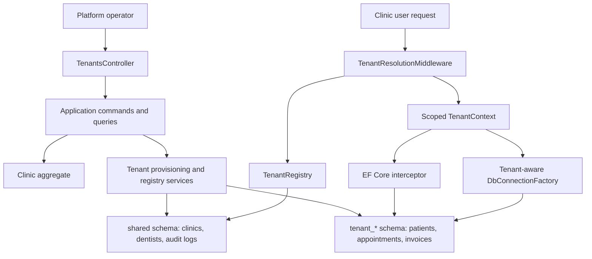

# Learning Journey: Tenant Provisioning

This folder is a guided engineering walkthrough for feature `003-tenant-provisioning`.
It is written as if a senior engineer were onboarding a junior developer into the
codebase after the feature shipped: what changed, why it changed, what tradeoffs
were made, and how to study the implementation without getting lost in the file
count.

## How To Use This Folder

Read these documents in order:

1. [README.md](./README.md): the big picture, business goal, and architectural map.
2. [architecture-walkthrough.md](./architecture-walkthrough.md): the deep technical explanation.
3. [code-reading-guide.md](./code-reading-guide.md): a practical study path with checkpoints and exercises.
4. [options-and-infrastructure-fixes.md](./options-and-infrastructure-fixes.md): a focused senior-level explanation of the tenancy options, DI, and schema-configuration fixes made after review.

The goal is not to memorize the code. The goal is to build the judgment to answer:

- Why is this code split across Domain, Application, Infrastructure, and API?
- Why do real projects use more ceremony than tutorial projects?
- Which parts protect business rules?
- Which parts protect data isolation?
- Which parts are production concerns rather than feature-demo concerns?

## The Feature In One Sentence

Tenant provisioning lets a platform operator create a clinic, allocate a dedicated
PostgreSQL schema for that clinic's operational data, run tenant migrations, and
make authenticated requests automatically use the correct schema.

That sentence hides a lot. In a tutorial, "create clinic" might mean one controller
method and one table insert. In this project, it means:

- A domain model that understands clinic lifecycle state.
- An application use case that coordinates validation and orchestration.
- Infrastructure that creates schemas, applies migrations, and manages PostgreSQL
  search paths safely.
- API endpoints that stay thin and policy-protected.
- Tests proving isolation across EF Core, Dapper, and concurrent tenants.

## Why This Feels Different From Tutorial Projects

Tutorial projects usually optimize for:

| Tutorial goal | Typical result |
| --- | --- |
| Teach one concept | The code is intentionally small |
| Show a happy path | Error handling is simplified |
| Avoid distractions | Security, concurrency, and rollback are skipped |
| Make the demo work quickly | Layers are collapsed |

Production-style projects optimize for different pressures:

| Real project pressure | What it forces into the design |
| --- | --- |
| The data must stay correct after failures | Transactions, compensation, explicit states |
| Tenants must not see each other's data | Schema isolation, middleware resolution, search path setup |
| Code must be testable without the web server | Application handlers and domain methods |
| Database behavior is provider-specific | Infrastructure abstractions and PostgreSQL-specific services |
| Operators need visibility | Audit logs, health status, migration status |
| Future developers must change safely | Small boundaries, contracts, focused tests |

This is why the feature spans many files. The size is not automatically good, but
the separation has a job: it keeps each kind of decision in the layer that owns it.

## The Mental Model

Think of tenant provisioning as two connected systems:

1. The control plane.
   This manages clinics, schemas, lifecycle state, migrations, and health.

2. The tenant data plane.
   This handles normal clinic operations after a request has resolved its tenant.

The control plane answers: "Which clinics exist, what schema do they own, and are
they allowed to receive traffic?"

The tenant data plane answers: "For this authenticated request, which schema should
EF Core and Dapper use?"

Keeping those two ideas separate is one of the most important design lessons in
this feature.

## The Three Database Areas

Feature 003 deliberately separates data into three PostgreSQL schema categories:

| Schema | Purpose | Example data |
| --- | --- | --- |
| `public` | Identity/auth infrastructure | ASP.NET Identity tables |
| `shared` | Cross-tenant registry data | Clinics, dentists, clinic-dentist links, audit logs |
| `tenant_*` | Clinic operational data | Patients, appointments, invoices, payments |

Why not put everything in one schema with `TenantId` columns?

That approach can work, but this feature chose schema-per-tenant for stronger
operational isolation. A missing `WHERE TenantId = ...` is one of the classic SaaS
bugs. Schema switching makes isolation more structural: once the search path is set,
normal operational queries naturally hit the current tenant schema.

That does not remove all risk. It moves the risk to a smaller and more testable
area: tenant resolution and search-path setup.

## The Layer Map

| Layer | Owns | Should not know |
| --- | --- | --- |
| Domain | Clinic rules, lifecycle state, domain events, validation invariants | EF Core, HTTP, PostgreSQL, Dapper |
| Application | Use cases, commands, queries, interfaces, orchestration | Concrete database APIs, controllers |
| Infrastructure | EF Core mappings, Dapper, PostgreSQL schemas, migrations, caching | HTTP response formatting |
| API | Routing, auth attributes, middleware pipeline, request/response entry points | Business rules and persistence details |
| Tests | Confidence that boundaries work | Production-only shortcuts |

That is why `Clinic` does not create PostgreSQL schemas, and
`TenantProvisioningService` does not decide whether a clinic name is valid. Each
part owns the decision it is closest to.

## What Was Delivered

The current feature includes:

- Clinic onboarding through `POST /api/v1/tenants/clinics`.
- Deterministic tenant schema naming.
- Shared registry tables under the `shared` schema.
- Tenant operational baseline under `tenant_*` schemas.
- Tenant resolution from the authenticated `tenant_id` claim.
- Search-path setup for EF Core and Dapper.
- Activation/deactivation of clinics without deleting tenant data.
- Clinic contact read/update endpoints.
- Tenant migration apply/status endpoints.
- Tests for domain behavior, application handlers, API behavior, isolation, schema
  switching, provisioning rollback, lifecycle access, and migrations.

One manual task remains in [tasks.md](../../specs/003-tenant-provisioning/tasks.md):

- `T076`: run the quickstart flow from [quickstart.md](../../specs/003-tenant-provisioning/quickstart.md).

Build and automated tests have passed, but manual quickstart validation is still
worth doing before treating the feature as fully release-verified.

## The Commit Story

The implementation was split into a reviewable stack:

| Commit theme | Why it is separate |
| --- | --- |
| Spec design artifacts | Explains what was intended before code |
| Domain lifecycle model | Business rules can be reviewed without PostgreSQL details |
| Application use cases | Orchestration can be reviewed without web or database plumbing |
| Docker context hygiene | Tooling change stands alone |
| Infrastructure provisioning | Database-specific implementation and migrations are heavy enough to isolate |
| API routing and tenant request path | HTTP and middleware behavior are reviewed together |
| Tests | Shows the confidence story and makes behavioral coverage visible |

Small commits are not just for aesthetics. They make review easier, rollback safer,
and future archaeology much less painful.

## Senior Engineer Takeaways

If you remember only a few lessons from this feature, remember these:

1. Real architecture is mostly about ownership.
   A layer exists because some decisions belong together and some decisions should
   not leak everywhere.

2. Tenant isolation is a security feature, not just a database trick.
   The important part is not only creating schemas. It is proving every request and
   every query uses the right schema.

3. Expected failures should be modeled, not thrown.
   Duplicate phone numbers, inactive tenants, unhealthy schemas, and migration
   conflicts are business or operational outcomes. They deserve explicit `Result`
   errors.

4. Infrastructure is where reality enters.
   PostgreSQL search paths, pooled connections, advisory locks, and migration
   history are not clean textbook concepts. They are the reason Infrastructure is
   its own layer.

5. Tests are design documentation.
   The tenant isolation tests explain the system almost as much as the production
   code does.

## Suggested Study Rhythm

Do not read all files alphabetically. That is how people drown.

Use this rhythm instead:

1. Read the [feature plan](../../specs/003-tenant-provisioning/plan.md) and this README.
2. Read the [Clinic aggregate](../../src/CliniKey.Domain/Entities/Clinic.cs) and [ClinicTests](../../tests/CliniKey.Tests/Domain/ClinicTests.cs).
3. Read [OnboardClinicCommandHandler](../../src/CliniKey.Application/Features/Tenants/Commands/OnboardClinic/OnboardClinicCommandHandler.cs).
4. Read [TenantProvisioningService](../../src/CliniKey.Infrastructure/Persistence/TenantProvisioningService.cs).
5. Read [TenantResolutionMiddleware](../../src/CliniKey.API/Middleware/TenantResolutionMiddleware.cs).
6. Read [TenantConnectionInterceptor](../../src/CliniKey.Infrastructure/Persistence/TenantConnectionInterceptor.cs) and [DbConnectionFactory](../../src/CliniKey.Infrastructure/Persistence/DbConnectionFactory.cs).
7. Read the integration tests last.

After that, read the deep walkthrough:

- [architecture-walkthrough.md](./architecture-walkthrough.md)

Then use the study exercises:

- [code-reading-guide.md](./code-reading-guide.md)
