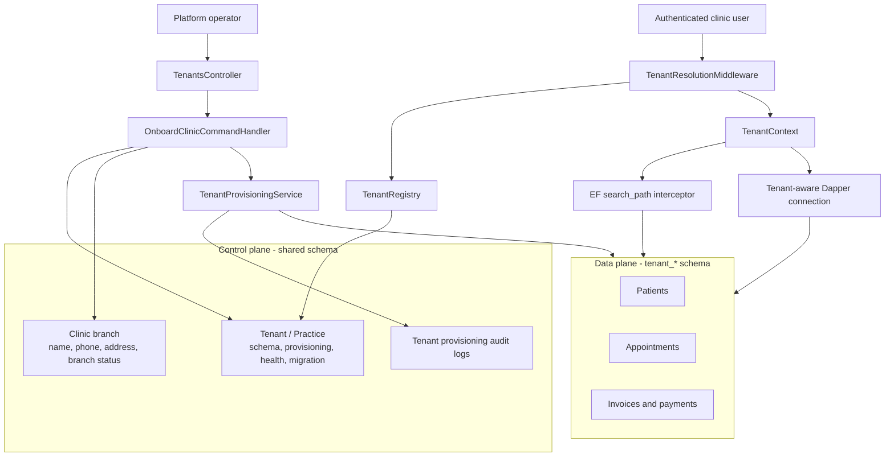

# Learning Journey: Tenant Provisioning

This folder explains feature `003-tenant-provisioning` after the tenant-boundary
refactor. Read it as internal engineering onboarding notes: what changed, why the
model changed, how the request flows, and where a future maintainer should be
careful.

## How To Use This Folder

Read these documents in order:

1. [README.md](./README.md): the mental model and release-level overview.
2. [feature-flow.md](./feature-flow.md): the end-to-end action flow from API request to provisioned tenant.
3. [architecture-walkthrough.md](./architecture-walkthrough.md): the deeper technical explanation.
4. [code-reading-guide.md](./code-reading-guide.md): a practical study path with questions and exercises.
5. [options-and-infrastructure-fixes.md](./options-and-infrastructure-fixes.md): configuration, DI, and schema-mapping lessons from review fixes.

## The Feature In One Sentence

Tenant provisioning lets a platform operator onboard a practice by creating a
`Tenant` as the isolation boundary, creating the first `Clinic` branch under it,
creating a dedicated PostgreSQL `tenant_*` schema, applying the tenant operational
baseline, and allowing later authenticated requests to resolve safely into that
schema.

## Why This Feature Is Not Just "Create A Clinic"

V1 still presents onboarding as "create one clinic" because that is the product
workflow. Internally, the model is now different:

| Concept | Current role |
| --- | --- |
| `Tenant` / practice | Owns schema name, provisioning status, schema health, current migration, lifecycle access |
| `Clinic` | Branch/location under a tenant; owns local contact and branch lifecycle |
| `shared` schema | Control-plane registry: tenants, clinics, dentists, clinic-dentist links, provisioning audit logs |
| `tenant_*` schema | Data-plane operational records: patients, appointments, treatment plans, invoices, payments |

That split matters before launch. If `Clinic` owns schema state, every future
multi-branch practice becomes awkward: which clinic owns the schema? Which branch
status blocks the whole practice? Which branch records the current migration?

The refactor answers those questions by making `Tenant` the isolation boundary.
`Clinic` becomes what the business actually means by branch or location.

## The Mental Model

Think in two planes:



The control plane answers: "Which practices exist, what schema do they own, and
are they ready to receive traffic?"

The data plane answers: "For this request, which tenant schema should operational
queries use?"

## Key Source Shape

| Area | Files to start with |
| --- | --- |
| Domain tenant boundary | [Tenant.cs](../../src/CliniKey.Domain/Entities/Tenant.cs), [TenantStatus.cs](../../src/CliniKey.Domain/Enums/TenantStatus.cs), [TenantProvisioningStatus.cs](../../src/CliniKey.Domain/Enums/TenantProvisioningStatus.cs), [TenantTests.cs](../../tests/CliniKey.Tests/Domain/TenantTests.cs) |
| Clinic branch model | [Clinic.cs](../../src/CliniKey.Domain/Entities/Clinic.cs), [ClinicTests.cs](../../tests/CliniKey.Tests/Domain/ClinicTests.cs) |
| Onboarding orchestration | [OnboardClinicCommandHandler.cs](../../src/CliniKey.Application/Features/Tenants/Commands/OnboardClinic/OnboardClinicCommandHandler.cs), [OnboardClinicCommandHandlerTests.cs](../../tests/CliniKey.Tests/Application/OnboardClinicCommandHandlerTests.cs) |
| Provisioning infrastructure | [TenantProvisioningService.cs](../../src/CliniKey.Infrastructure/Persistence/TenantProvisioningService.cs), [TenantMigrationService.cs](../../src/CliniKey.Infrastructure/Persistence/TenantMigrationService.cs) |
| Registry and request resolution | [TenantRegistry.cs](../../src/CliniKey.Infrastructure/Persistence/TenantRegistry.cs), [TenantResolutionMiddleware.cs](../../src/CliniKey.API/Middleware/TenantResolutionMiddleware.cs), [TenantContext.cs](../../src/CliniKey.Infrastructure/Persistence/TenantContext.cs) |
| Shared mappings | [TenantConfiguration.cs](../../src/CliniKey.Infrastructure/Persistence/Configurations/TenantConfiguration.cs), [ClinicConfiguration.cs](../../src/CliniKey.Infrastructure/Persistence/Configurations/ClinicConfiguration.cs), [SharedDbContext.cs](../../src/CliniKey.Infrastructure/Persistence/SharedDbContext.cs) |

## What Was Delivered

- `Tenant` aggregate added as the practice isolation boundary.
- `TenantCreatedEvent`, `TenantProvisionedEvent`, `TenantActivatedEvent`, and `TenantDeactivatedEvent` model lifecycle changes.
- `Clinic` simplified into a branch/location under a tenant through `TenantId`.
- V1 onboarding still accepts one clinic payload, but creates `Tenant + first Clinic`.
- Schema name, provisioning status, schema health, and current migration moved to `Tenant`.
- Shared registry migrations now create `shared.tenants` and `shared.clinics` with `tenant_id`.
- Tenant resolution reads `shared.tenants`, validates active tenant status, `Provisioned` provisioning status, and healthy schema state.
- Auth registration maps the selected clinic to its tenant before storing user `TenantId`.
- Tenant migrations target tenants rather than clinics.
- List/get clinic responses expose both branch status and tenant lifecycle status.

## Verification Status

Automated verification completed during the refactor:

```text
dotnet build CliniKey.slnx --no-restore
dotnet test CliniKey.slnx --no-build --filter "Category!=Integration"
```

The non-integration suite passed with 161 tests. A full integration run still
depends on Docker/Testcontainers availability in the local environment. The manual
quickstart in [quickstart.md](../../specs/003-tenant-provisioning/quickstart.md)
should still be run before launch sign-off.

## Senior Engineer Takeaways

1. Isolation boundaries should match the long-term domain, not only the first UI flow.
2. V1 can onboard one branch while the model still supports a practice with many branches later.
3. Provisioning status, schema health, and tenant lifecycle are different states and should not be collapsed.
4. Tenant resolution is access control, not a convenience lookup.
5. Shared mappings deserve as much review as tenant schemas because one wrong table location can bypass isolation.

## Suggested Study Rhythm

1. Read [feature-flow.md](./feature-flow.md) for the full story.
2. Read [Tenant.cs](../../src/CliniKey.Domain/Entities/Tenant.cs) beside [Clinic.cs](../../src/CliniKey.Domain/Entities/Clinic.cs).
3. Read [OnboardClinicCommandHandler.cs](../../src/CliniKey.Application/Features/Tenants/Commands/OnboardClinic/OnboardClinicCommandHandler.cs).
4. Read [TenantProvisioningService.cs](../../src/CliniKey.Infrastructure/Persistence/TenantProvisioningService.cs) and [TenantMigrationService.cs](../../src/CliniKey.Infrastructure/Persistence/TenantMigrationService.cs).
5. Read [TenantRegistry.cs](../../src/CliniKey.Infrastructure/Persistence/TenantRegistry.cs) and [TenantResolutionMiddleware.cs](../../src/CliniKey.API/Middleware/TenantResolutionMiddleware.cs).
6. Finish with [code-reading-guide.md](./code-reading-guide.md) and its exercises.
