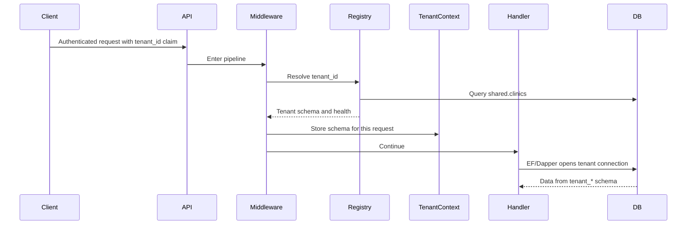
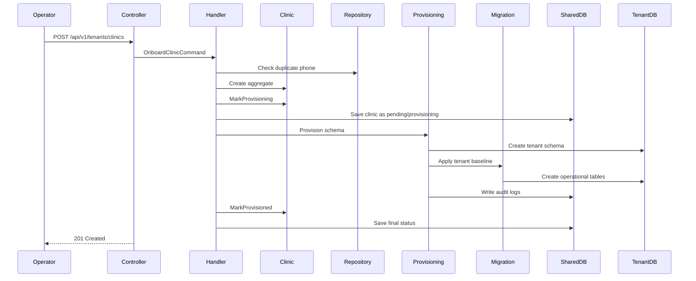

# Architecture Walkthrough: Tenant Provisioning

This document explains feature `003-tenant-provisioning` from the perspective of
engineering design. It focuses on the "why" behind the code, not just the "what".

## 1. The Business Problem

CliniKey is moving from a simple application into a multi-tenant SaaS shape. That
means the system must support multiple clinics while keeping their operational data
separate.

The platform needs to answer these questions:

- How does a new clinic get created?
- Where does that clinic's operational data live?
- How does the system know which tenant a request belongs to?
- How do EF Core and Dapper both query the correct tenant data?
- How do operators deactivate a clinic without deleting its historical data?
- How do we migrate all tenant schemas over time?

A small tutorial app would often answer these questions with one table and one
controller method. A production-style app has to answer them in a way that survives
failure, concurrency, review, and future change.

## 2. The Main Design Choice: Schema-Per-Tenant

This feature uses PostgreSQL schemas for tenant isolation:

```text
public
  ASP.NET Identity and auth tables

shared
  clinics
  dentists
  clinic_dentists
  tenant_provisioning_audit_logs

tenant_abc123
  patients
  appointments
  treatment_plans
  invoices
  payments
```

The core idea is simple:

- Cross-tenant data lives in `shared`.
- Clinic operational data lives in that clinic's `tenant_*` schema.
- The request pipeline resolves the tenant and sets PostgreSQL `search_path`.

The important senior-engineer point is this: schema-per-tenant is not just a data
modeling choice. It is a runtime behavior choice. Every database connection has to
be prepared correctly before queries run.

## 3. The Request-Time Flow

For normal tenant-scoped requests, the flow is:



Key files:

- [TenantResolutionMiddleware.cs](../../src/CliniKey.API/Middleware/TenantResolutionMiddleware.cs)
- [TenantRegistry.cs](../../src/CliniKey.Infrastructure/Persistence/TenantRegistry.cs)
- [TenantContext.cs](../../src/CliniKey.Infrastructure/Persistence/TenantContext.cs)
- [TenantConnectionInterceptor.cs](../../src/CliniKey.Infrastructure/Persistence/TenantConnectionInterceptor.cs)
- [DbConnectionFactory.cs](../../src/CliniKey.Infrastructure/Persistence/DbConnectionFactory.cs)

### Why Middleware?

Middleware is used because tenant resolution is not a single endpoint behavior.
It is a request-wide precondition.

If a request is tenant-scoped, the application should not let it reach handlers
until the tenant is known, active, and healthy. The middleware is the gate.

### Why A Scoped TenantContext?

`TenantContext` is scoped to the request. It stores:

- tenant ID
- schema name
- clinic status
- schema health status

This lets downstream infrastructure read the current tenant without passing schema
names through every method signature.

That is a pragmatic production pattern. Passing tenant context explicitly everywhere
can be pure, but it becomes noisy. A scoped context keeps the boundary clear while
avoiding repetitive parameters.

### Why Validate Status And Health?

Resolving a tenant is not enough. A tenant can exist but still be unusable:

- inactive clinic
- suspended clinic
- unhealthy schema
- missing registry row

`TenantRegistry.Validate` turns those states into explicit errors. That matters
because the system should fail before data access happens.

## 4. The Onboarding Flow

Clinic onboarding is the control-plane path that creates a tenant.



Key files:

- [OnboardClinicCommandHandler.cs](../../src/CliniKey.Application/Features/Tenants/Commands/OnboardClinic/OnboardClinicCommandHandler.cs)
- [Clinic.cs](../../src/CliniKey.Domain/Entities/Clinic.cs)
- [TenantProvisioningService.cs](../../src/CliniKey.Infrastructure/Persistence/TenantProvisioningService.cs)
- [TenantMigrationService.cs](../../src/CliniKey.Infrastructure/Persistence/TenantMigrationService.cs)
- [ClinicRepository.cs](../../src/CliniKey.Infrastructure/Persistence/Repositories/ClinicRepository.cs)

### Why Does The Handler Orchestrate?

The handler is the application use case. It knows the story:

1. Validate phone value.
2. Check duplicate phone in the clinic registry.
3. Generate clinic ID and schema name.
4. Create the `Clinic` aggregate.
5. Save the clinic in provisioning state.
6. Ask infrastructure to create and migrate the schema.
7. Mark the clinic provisioned or roll back the registry row.

Notice what the handler does not know:

- How PostgreSQL creates schemas.
- How migrations are applied.
- How audit logs are persisted internally.

That is Clean Architecture in practice. The handler coordinates policy; the
Infrastructure layer performs technical details.

### Why Save Before Provisioning?

The system saves the clinic as provisioning before running schema creation. That
gives the database a registry record for the tenant lifecycle. If provisioning
fails, the handler removes that clinic record and the provisioning service tries to
drop the schema.

The important concept is not "perfect distributed transaction". The important
concept is deliberate compensation:

- If schema migration fails, drop the tenant schema.
- If provisioning fails, remove the registry row.
- Record audit logs for operations where possible.

In real systems, perfect atomicity across every side effect is often impossible.
Senior engineers design recovery and cleanup paths instead of pretending failure
does not happen.

### Why Deterministic Schema Names?

The handler generates:

```csharp
tenant_{clinicId:N}
```

then truncates to a short name. The goal is:

- stable naming
- PostgreSQL-safe characters
- no user-controlled schema names

User-controlled schema names are dangerous because schema names become SQL
identifiers. Even with quoting, letting users choose infrastructure identifiers is
usually unnecessary risk.

## 5. The Domain Layer

The central domain type is:

- [Clinic.cs](../../src/CliniKey.Domain/Entities/Clinic.cs)

`Clinic` owns business state:

- name
- phone
- address
- immutable schema name
- active/inactive/suspended status
- provisioning status
- schema health status
- current migration
- deactivation metadata

The aggregate exposes methods like:

- `Create`
- `MarkProvisioning`
- `MarkProvisioned`
- `MarkProvisioningFailed`
- `Activate`
- `Deactivate`
- `Suspend`
- `UpdateContact`
- `MarkSchemaHealth`

### Why Not Set Properties Directly?

In tutorial code you often see:

```csharp
clinic.Status = ClinicStatus.Inactive;
```

In this project, state transitions go through methods:

```csharp
clinic.Deactivate(operatorUserId);
```

That difference matters. A method can enforce rules:

- Do not deactivate an already inactive clinic.
- Capture timestamp consistently.
- store the operator ID.
- Raise a domain event.
- Mark the aggregate as updated.

Properties store facts. Methods protect transitions.

### Why Result Instead Of Exceptions?

Domain methods return `Result` for expected failures:

- invalid name
- invalid phone
- invalid schema name
- already active
- already inactive
- invalid migration

These are not programming bugs. They are expected outcomes of user input or business
state. Returning `Result` makes the failure part of the method contract.

Exceptions are still appropriate for unexpected technical failures. But a duplicate
phone number is not exceptional in a SaaS product. It is a user-facing conflict.

### Why TimeProvider?

The aggregate uses `TimeProvider` through the shared `AggregateRoot`. This keeps
time testable.

Tutorial code often calls:

```csharp
DateTime.UtcNow
```

Production-style code injects a clock so tests can say:

```text
At exactly 2026-05-23T09:00:00Z, deactivate the clinic.
```

Then assertions are deterministic.

## 6. Application Layer

The application layer contains use cases:

```text
src/CliniKey.Application/Features/Tenants/
  Commands/
    OnboardClinic/
    ActivateClinic/
    DeactivateClinic/
    UpdateClinicContact/
    MigrateTenantSchemas/
  Queries/
    GetClinicById/
    ListClinics/
    GetTenantSchemaHealth/
```

The application layer also owns abstractions:

```text
src/CliniKey.Application/Abstractions/Tenancy/
  ITenantContext.cs
  ITenantRegistry.cs
  ITenantProvisioningService.cs
  ITenantMigrationService.cs
```

This is one of the biggest shifts from tutorial projects.

The Application layer says:

> I need tenant provisioning capability.

It does not say:

> I need Npgsql to execute CREATE SCHEMA.

That distinction is what keeps the use case testable. Application tests can mock
`ITenantProvisioningService` and focus on orchestration.

## 7. Infrastructure Layer

Infrastructure is where PostgreSQL reality lives.

Key files:

- `TenantProvisioningService.cs`
- `TenantMigrationService.cs`
- `TenantRegistry.cs`
- `TenantConnectionInterceptor.cs`
- `DbConnectionFactory.cs`
- `PostgresIdentifier.cs`
- `SharedDbContext.cs`
- `TenancyOptions.cs`
- EF Core configurations and migrations

### Why Infrastructure Is Larger Than Domain

Infrastructure deals with the messy details:

- SQL identifiers must be quoted safely.
- Schemas must be created if missing.
- Search path must be set on each opened connection.
- Connections are pooled and reused.
- Migration history must exist per tenant schema.
- Operators need audit logs.
- Concurrent migration jobs need locking.

This code is less elegant than the domain model because the outside world is less
elegant than the domain model.

That is normal.

### Why Set search_path Every Time?

PostgreSQL connections are pooled. That means a connection used for Tenant A can
later be reused for Tenant B.

If the app sets `search_path` once and assumes it stays correct, that assumption can
leak data.

The feature sets search path in two places:

- EF Core: `TenantConnectionInterceptor`
- Dapper: `CreateTenantConnection`

This is deliberate duplication at the technology boundary. EF Core and Dapper open
connections differently, so each needs a safe tenant-aware path.

### Why Both EF Core And Dapper?

The project uses a CQRS style:

- Commands typically use EF Core and domain aggregates.
- Queries can use Dapper and DTOs.

EF Core is useful when you are changing aggregate state and want change tracking,
transactions, and domain persistence.

Dapper is useful when you are projecting query results and want explicit SQL.

The key lesson: architectural patterns are not fashion choices. They encode
tradeoffs.

## 8. API Layer

The API layer contains:

- `TenantsController`
- `TenantMigrationsController`
- `TenantResolutionMiddleware`
- Program registration and authorization policy setup

Controllers stay thin:

```text
HTTP request -> MediatR command/query -> Result -> HTTP response
```

They do not:

- create schemas
- check duplicate phones
- manipulate aggregate state directly
- open database connections

### Why Policy-Based Authorization?

Tenant-management endpoints use:

```csharp
[Authorize(Policy = Policies.CanManageTenants)]
```

That expresses intent better than raw role strings. It also gives the project one
place to evolve authorization rules later.

For example, today `CanManageTenants` may mean "PlatformOperator role". Later it
might mean "PlatformOperator plus MFA plus internal network". The controller should
not care.

## 9. Migration Operations

Tenant schemas are not static. When the product evolves, existing tenants need new
tables, columns, indexes, or constraints.

This feature adds:

- `POST /api/v1/tenants/migrations/apply`
- `GET /api/v1/tenants/migrations/status`

The migration command:

1. Selects target clinics.
2. Applies pending migrations.
3. Marks schema health as healthy or unhealthy.
4. Invalidates tenant registry cache.
5. Returns per-tenant results.

The senior-engineer lesson is that onboarding is only day one. Operations are day
two. Real systems need both.

## 10. Caching And Invalidation

`TenantRegistry` caches tenant registry entries briefly.

Why cache?

- Tenant resolution happens on every tenant-scoped request.
- Looking up `shared.clinics` every time adds avoidable database load.

Why short TTL and explicit invalidation?

- Tenant status and schema health affect access.
- If a clinic is deactivated, users should not keep access for long.
- Migration and lifecycle commands call invalidation where needed.

Caching is a correctness tradeoff. The cache is not just a performance detail.
It changes how quickly operational state is observed.

## 11. Testing Strategy

The test suite covers the feature at several levels:

| Test area | What it proves |
| --- | --- |
| Domain tests | Clinic lifecycle rules work without database or HTTP |
| Application handler tests | Use cases orchestrate dependencies correctly |
| API tests | Controllers and middleware return expected HTTP behavior |
| Infrastructure integration tests | PostgreSQL schemas, search paths, migrations, and isolation work |
| Concurrent isolation tests | Multiple tenants do not bleed into each other under parallel access |

This is a mature testing shape. It avoids the two common extremes:

- Only unit tests, which miss database behavior.
- Only end-to-end tests, which are slow and hard to diagnose.

## 12. The Most Important Tradeoffs

### Tradeoff: Schema-Per-Tenant vs TenantId Column

Schema-per-tenant gives stronger physical separation and cleaner operational
queries, but adds complexity:

- schema creation
- tenant migrations
- search path setup
- more integration testing

TenantId columns are simpler operationally, but every query must remember the
tenant predicate.

This feature chose stronger isolation and accepted more infrastructure complexity.

### Tradeoff: SharedDbContext Plus AppDbContext

The feature uses a focused `SharedDbContext` for shared registry data while
`AppDbContext` handles operational data with tenant search-path behavior.

That separation helps avoid accidentally treating registry data like tenant-local
data.

The cost is more EF configuration and migrations to understand.

### Tradeoff: Manual Tenant Migration SQL

`TenantMigrationService` applies a baseline through explicit SQL. EF migrations are
also generated under tenant migration folders.

This gives direct control over schema-qualified creation, but it is an area to keep
watching as the product grows. Over time, the team may want more automation around
per-tenant EF migration execution.

### Tradeoff: Middleware Skips Tenant Management Routes

Tenant-management routes are control-plane routes. They manage tenants and are
protected by platform-operator authorization, so they skip normal tenant resolution.

That is correct for this feature. But it means every new route must be classified:

- Is this control-plane?
- Or is this tenant-scoped data-plane?

Misclassifying a route is a real security risk.

## 13. A Senior Review Checklist

When reviewing future tenant-related code, ask:

- Does this route require tenant resolution?
- Does this query use tenant-scoped or shared data?
- If it is tenant-scoped Dapper, does it use `CreateTenantConnection`?
- If it is EF Core tenant data, does it run after `TenantContext` is resolved?
- If a clinic is inactive, can the request still reach data access?
- Are expected failures represented as `Result` errors?
- Is the schema name generated by the system rather than accepted from the user?
- Are PostgreSQL identifiers quoted through the helper?
- Is cache invalidation needed after this state change?
- Does the test prove the boundary that could leak tenant data?

That checklist is more valuable than memorizing the current implementation.

## 14. What To Watch Next

This feature is strong, but real systems keep evolving. Future hardening areas may
include:

- Running the full quickstart flow manually.
- Auditing every new Dapper query for tenant-aware connection usage.
- Deciding whether tenant migration execution should rely more directly on EF Core
  migration APIs over time.
- Adding observability around tenant resolution failures and migration duration.
- Reviewing cache duration in production load tests.
- Expanding authorization around platform operations.
- Documenting operational runbooks for failed tenant provisioning.

The mark of a real project is not that every answer is final. It is that the system
has clear places where future answers belong.
