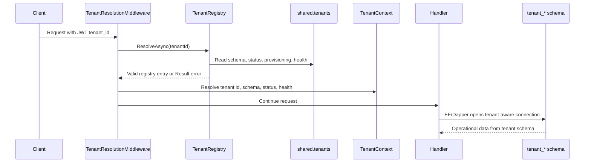
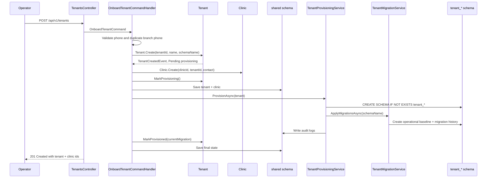

# Architecture Walkthrough: Tenant Provisioning

This walkthrough explains the current implementation after correcting the tenancy
model. The important shift is simple: `Tenant` or practice is the isolation
boundary; `Clinic` is a branch/location under that boundary.

## 1. Business Problem

CliniKey needs to onboard practices into a multi-tenant SaaS system. V1 onboards
one clinic location, but the architecture must not trap the product into "one
clinic equals one tenant" forever.

The system must answer:

- Who owns the database schema?
- Which state blocks all practice access?
- Where is the current migration recorded?
- How does a first branch get created during onboarding?
- How does a clinic user later resolve to the correct schema?
- How can platform operators deactivate, reactivate, and migrate tenants safely?

The answer in this implementation is:

```text
Tenant/Practice owns isolation and schema state.
Clinic owns branch/location identity and contact state.
```

## 2. Main Design Choices

| Decision | Why it matters |
| --- | --- |
| `Tenant` aggregate owns schema/provisioning/health/migration | Prevents branch records from becoming infrastructure owners |
| `Clinic` has `TenantId` | Allows V1 first-branch onboarding and future multi-branch practices |
| Shared registry tables live in `shared` | Platform operations and tenant resolution must work outside a tenant schema |
| Operational data lives in `tenant_*` | Patient and billing data is isolated by PostgreSQL schema |
| Tenant registry validates lifecycle before request continuation | Invalid tenants fail before handlers touch data |
| EF and Dapper both set `search_path` | Connection pooling makes per-open setup mandatory |

## 3. Runtime Request Flow

Normal tenant-scoped requests use the authenticated user's `tenant_id` claim:



Key files:

- [TenantResolutionMiddleware.cs](../../src/CliniKey.API/Middleware/TenantResolutionMiddleware.cs)
- [TenantRegistry.cs](../../src/CliniKey.Infrastructure/Persistence/TenantRegistry.cs)
- [ITenantRegistry.cs](../../src/CliniKey.Application/Abstractions/Tenancy/ITenantRegistry.cs)
- [TenantContext.cs](../../src/CliniKey.Infrastructure/Persistence/TenantContext.cs)
- [TenantConnectionInterceptor.cs](../../src/CliniKey.Infrastructure/Persistence/TenantConnectionInterceptor.cs)
- [DbConnectionFactory.cs](../../src/CliniKey.Infrastructure/Persistence/DbConnectionFactory.cs)

`TenantRegistry` rejects tenants that are missing, inactive, not fully
provisioned, or schema-unhealthy. That is not only validation. It is the front
door for tenant data access.

## 4. Onboarding Write Flow

The product call still says "onboard clinic", but internally it creates both the
practice boundary and its first branch.



Key files:

- [OnboardTenantCommandHandler.cs](../../src/CliniKey.Application/Features/Tenants/Commands/OnboardTenant/OnboardTenantCommandHandler.cs)
- [OnboardTenantResponse.cs](../../src/CliniKey.Application/Features/Tenants/Commands/OnboardTenant/OnboardTenantResponse.cs)
- [Tenant.cs](../../src/CliniKey.Domain/Entities/Tenant.cs)
- [Clinic.cs](../../src/CliniKey.Domain/Entities/Clinic.cs)
- [TenantProvisioningService.cs](../../src/CliniKey.Infrastructure/Persistence/TenantProvisioningService.cs)
- [TenantMigrationService.cs](../../src/CliniKey.Infrastructure/Persistence/TenantMigrationService.cs)

The handler is intentionally the coordinator. It does not know PostgreSQL details,
but it does know the application story: validate, create domain objects, persist
the registry state, provision infrastructure, then finalize the tenant.

## 5. Domain Layer

The domain has two different aggregates with different responsibilities.

### Tenant

[Tenant.cs](../../src/CliniKey.Domain/Entities/Tenant.cs) owns:

- `SchemaName`
- `TenantStatus`
- `TenantProvisioningStatus`
- `TenantSchemaHealthStatus`
- `CurrentMigration`
- `LastSchemaVerifiedAtUtc`
- deactivation metadata
- tenant lifecycle events

Important methods:

- `Create`
- `MarkProvisioning`
- `MarkProvisioned`
- `MarkProvisioningFailed`
- `Activate`
- `Deactivate`
- `Suspend`
- `MarkSchemaHealth`
- `AddClinic`

`Tenant.Create` raises [TenantCreatedEvent.cs](../../src/CliniKey.Domain/Events/TenantCreatedEvent.cs).
Provisioning, activation, and deactivation raise their own events.

### Clinic

[Clinic.cs](../../src/CliniKey.Domain/Entities/Clinic.cs) owns:

- `TenantId`
- branch name
- phone
- address
- branch status
- branch deactivation metadata
- branch-to-dentist links

Clinic no longer owns `SchemaName`, provisioning status, schema health, or current
migration. That is the heart of the refactor.

## 6. Application Layer

Application use cases live under [Features/Tenants](../../src/CliniKey.Application/Features/Tenants/).

| Use case | Current tenant-boundary behavior |
| --- | --- |
| Onboard clinic | Creates `Tenant + Clinic`, provisions tenant schema |
| Activate/deactivate clinic endpoints | Resolve branch, then activate/deactivate the owning tenant for V1 |
| List/get clinics | Return branch fields plus tenant lifecycle fields |
| Get tenant schema health | Reads tenant schema state |
| Migrate tenant schemas | Targets tenant IDs and tenant schema names |

Application abstractions keep infrastructure out of handlers:

- [ITenantRegistry.cs](../../src/CliniKey.Application/Abstractions/Tenancy/ITenantRegistry.cs)
- [ITenantProvisioningService.cs](../../src/CliniKey.Application/Abstractions/Tenancy/ITenantProvisioningService.cs)
- [ITenantMigrationService.cs](../../src/CliniKey.Application/Abstractions/Tenancy/ITenantMigrationService.cs)
- [ITenantContext.cs](../../src/CliniKey.Application/Abstractions/Tenancy/ITenantContext.cs)

## 7. Infrastructure Layer

Infrastructure contains the PostgreSQL-specific work:

- [TenantConfiguration.cs](../../src/CliniKey.Infrastructure/Persistence/Configurations/TenantConfiguration.cs) maps `Tenant` to `shared.tenants`.
- [ClinicConfiguration.cs](../../src/CliniKey.Infrastructure/Persistence/Configurations/ClinicConfiguration.cs) maps `Clinic` to `shared.clinics`.
- [SharedDbContext.cs](../../src/CliniKey.Infrastructure/Persistence/SharedDbContext.cs) owns shared registry migrations and seed data.
- [AppDbContext.cs](../../src/CliniKey.Infrastructure/Persistence/AppDbContext.cs) can read shared entities but excludes shared tables from tenant migrations.
- [TenantProvisioningService.cs](../../src/CliniKey.Infrastructure/Persistence/TenantProvisioningService.cs) creates schemas, calls migration service, and writes audit logs.
- [TenantMigrationService.cs](../../src/CliniKey.Infrastructure/Persistence/TenantMigrationService.cs) creates the operational baseline and migration history.
- [TenantRegistry.cs](../../src/CliniKey.Infrastructure/Persistence/TenantRegistry.cs) caches and validates tenant registry entries.

The migrations are split by responsibility:

- [Shared migration](../../src/CliniKey.Infrastructure/Persistence/Migrations/Shared/20260523090312_AddSharedTenantRegistry.cs) creates `shared.tenants`, `shared.clinics`, shared dentists, clinic dentists, and audit logs.
- [Tenant migration](../../src/CliniKey.Infrastructure/Persistence/Migrations/Tenant/20260523090321_InitialTenantOperationalSchema.cs) represents operational tenant tables.

## 8. API Layer

[TenantsController.cs](../../src/CliniKey.API/Controllers/TenantsController.cs)
contains platform control-plane endpoints:

- `POST /api/v1/tenants`
- `GET /api/v1/tenants`
- `GET /api/v1/tenants/{tenantId}`
- `PUT /api/v1/tenants/{tenantId}/clinics/{clinicId}/contact`
- `POST /api/v1/tenants/{tenantId}/deactivate`
- `POST /api/v1/tenants/{tenantId}/activate`
- `POST /api/v1/tenants/migrations/apply`
- `GET /api/v1/tenants/migrations/status`

These endpoints are protected by `Policies.CanManageTenants` and skip normal tenant
resolution because they operate on the control plane.

Tenant-scoped product endpoints do not skip resolution. They require the middleware
to set `TenantContext` before EF or Dapper access.

## 9. Operational Concerns

### Provisioning Is Not A Single Insert

Onboarding touches:

- shared tenant row
- shared first clinic row
- PostgreSQL schema creation
- operational tenant tables
- tenant migration history
- audit logs
- registry cache behavior later

That is why provisioning has explicit states and compensation. If migration fails,
the service attempts to drop the schema and returns `TenantErrors.ProvisioningFailed`.

### Cache Invalidation Matters

`TenantRegistry` caches tenant entries. Lifecycle and migration operations call
`InvalidateAsync` so request access does not keep using stale status or health.

### Connection State Is Dangerous

PostgreSQL `search_path` lives on the connection. Connections are pooled. The app
sets search path on each tenant-aware EF and Dapper connection because assuming old
connection state is how tenant data leaks happen.

## 10. Testing Strategy

| Test area | Files | What it proves |
| --- | --- | --- |
| Domain | [TenantTests.cs](../../tests/CliniKey.Tests/Domain/TenantTests.cs), [ClinicTests.cs](../../tests/CliniKey.Tests/Domain/ClinicTests.cs) | State transitions, events, timestamps |
| Application | [OnboardTenantCommandHandlerTests.cs](../../tests/CliniKey.Tests/Application/OnboardTenantCommandHandlerTests.cs), [ClinicLifecycleCommandHandlerTests.cs](../../tests/CliniKey.Tests/Application/ClinicLifecycleCommandHandlerTests.cs), [TenantMigrationCommandHandlerTests.cs](../../tests/CliniKey.Tests/Application/TenantMigrationCommandHandlerTests.cs) | Use-case orchestration |
| API | [TenantsControllerTests.cs](../../tests/CliniKey.Tests/API/TenantsControllerTests.cs), [TenantResolutionMiddlewareTests.cs](../../tests/CliniKey.Tests/API/TenantResolutionMiddlewareTests.cs) | Thin controllers and middleware gates |
| Infrastructure | [TenantProvisioningIntegrationTests.cs](../../tests/CliniKey.Tests/Infrastructure/TenantProvisioningIntegrationTests.cs), [TenantLifecycleAccessTests.cs](../../tests/CliniKey.Tests/Infrastructure/TenantLifecycleAccessTests.cs), [TenantSchemaSwitchingTests.cs](../../tests/CliniKey.Tests/Infrastructure/TenantSchemaSwitchingTests.cs), [TenantDapperConnectionTests.cs](../../tests/CliniKey.Tests/Infrastructure/TenantDapperConnectionTests.cs) | PostgreSQL behavior and tenant isolation |

## 11. Tradeoffs

Schema-per-tenant gives stronger physical isolation, but it makes provisioning,
migrations, and connection setup more complex.

Having both `Tenant` and `Clinic` adds model vocabulary, but it prevents the first
branch from pretending to be the whole practice forever.

Using a shared control plane adds mapping complexity, but it gives operators a
safe place to manage tenants without resolving into a tenant schema.

## 12. Senior Review Checklist

When reviewing future tenancy changes, ask:

- Is this code operating on the control plane or the tenant data plane?
- Does this state belong to `Tenant` or to `Clinic`?
- Does request access require `TenantStatus.Active`, `ProvisioningStatus.Provisioned`, and `SchemaHealthStatus.Healthy`?
- Does any Dapper tenant query use the tenant-aware connection factory?
- Does any EF tenant operation happen without a resolved `TenantContext`?
- Are shared tables explicitly mapped to the shared schema?
- Does a lifecycle or health change invalidate the tenant registry cache?
- Does a new response field clearly distinguish tenant lifecycle from branch lifecycle?

## 13. What To Watch Next

- Add first-class branch management when V1 grows beyond one clinic.
- Revisit endpoint names so tenant lifecycle operations are not forever named only after clinics.
- Run the manual quickstart in [quickstart.md](../../specs/003-tenant-provisioning/quickstart.md).
- Continue hardening integration tests around Docker/Testcontainers availability.
- Add observability for provisioning duration, migration duration, and tenant resolution failures.
