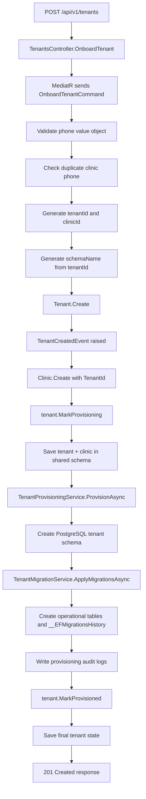
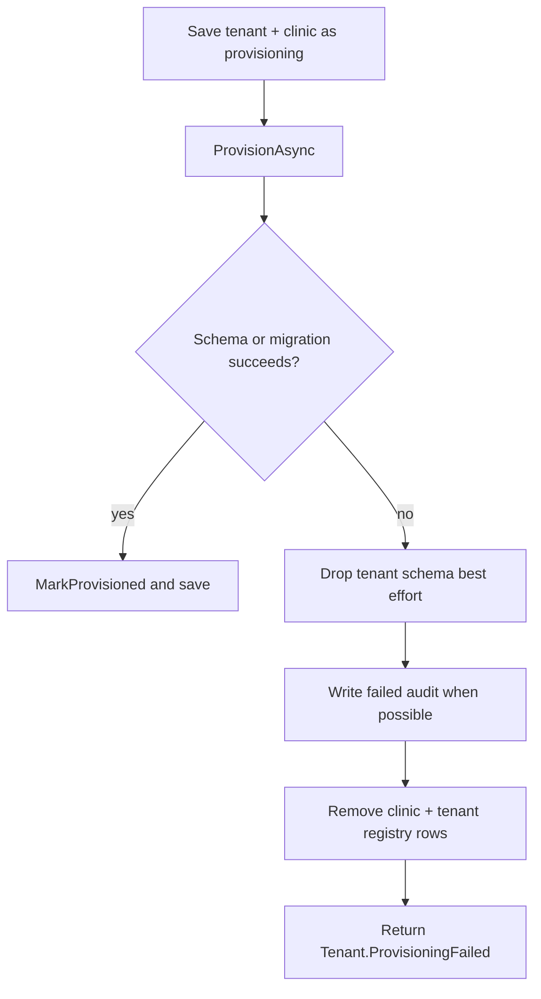
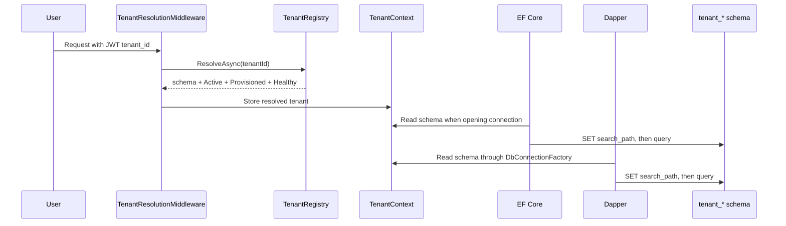

# Feature Flow: Tenant Provisioning

This file follows the implemented feature as an action flow. It starts with the
API request and follows the system until a practice has a tenant registry row, a
first clinic branch, a tenant schema, migration history, and access-control rules
for future requests.

## Flow 1: Platform Operator Onboards A Practice

The public workflow is still "onboard a clinic". The internal workflow is
"create tenant/practice plus first clinic branch".



### Step 1: API Receives The Request

The route is implemented in [TenantsController.cs](../../src/CliniKey.API/Controllers/TenantsController.cs).

```http
POST /api/v1/tenants
```

The controller is intentionally thin. It sends
[OnboardTenantCommand.cs](../../src/CliniKey.Application/Features/Tenants/Commands/OnboardTenant/OnboardTenantCommand.cs)
through MediatR and returns `CreatedAtAction` when the command succeeds.

The endpoint is protected by `Policies.CanManageTenants`, so this is a platform
control-plane action, not a normal tenant-scoped clinic-user action.

### Step 2: Application Handler Coordinates The Story

[OnboardTenantCommandHandler.cs](../../src/CliniKey.Application/Features/Tenants/Commands/OnboardTenant/OnboardTenantCommandHandler.cs)
does the orchestration:

1. Build a `PhoneNumber` value object.
2. Check duplicate phone through [IClinicRepository.cs](../../src/CliniKey.Domain/Repositories/IClinicRepository.cs).
3. Generate a tenant ID and clinic ID.
4. Generate the schema name through `ITenantSchemaNameGenerator`.
5. Create the `Tenant`.
6. Create the first `Clinic` branch with `TenantId`.
7. Mark tenant provisioning started.
8. Persist shared registry state.
9. Ask infrastructure to provision the schema.
10. Mark the tenant provisioned with the current migration.

This handler is the best place to understand why V1 can still onboard one clinic
while the internal model is already tenant-first.

### Step 3: Domain Creates The Practice Boundary

[Tenant.cs](../../src/CliniKey.Domain/Entities/Tenant.cs) owns the isolation
boundary. During creation:

- `SchemaName` is immutable.
- `Status` starts as `Active`.
- `ProvisioningStatus` starts as `Pending`.
- `SchemaHealthStatus` starts as `Unknown`.
- [TenantCreatedEvent.cs](../../src/CliniKey.Domain/Events/TenantCreatedEvent.cs) is raised.

Then the handler calls `MarkProvisioning`, moving the tenant into the active
provisioning workflow before the first save.

### Step 4: Domain Creates The First Branch

[Clinic.cs](../../src/CliniKey.Domain/Entities/Clinic.cs) now represents a branch
or location:

- It stores `TenantId`.
- It stores branch name, phone, and address.
- It owns branch lifecycle status.
- It does not store schema name, provisioning status, schema health, or current migration.

That absence is part of the design. If a practice later has three branches, the
schema and migration state still belong to the practice, not to one branch.

### Step 5: Shared Registry Is Saved

The shared registry uses explicit shared-schema mappings:

- [TenantConfiguration.cs](../../src/CliniKey.Infrastructure/Persistence/Configurations/TenantConfiguration.cs)
- [ClinicConfiguration.cs](../../src/CliniKey.Infrastructure/Persistence/Configurations/ClinicConfiguration.cs)
- [SharedDbContext.cs](../../src/CliniKey.Infrastructure/Persistence/SharedDbContext.cs)
- [AppDbContext.cs](../../src/CliniKey.Infrastructure/Persistence/AppDbContext.cs)

The first save gives the platform a durable `shared.tenants` row and
`shared.clinics` row before infrastructure provisioning begins.

### Step 6: Infrastructure Creates The Schema

[TenantProvisioningService.cs](../../src/CliniKey.Infrastructure/Persistence/TenantProvisioningService.cs)
owns PostgreSQL-specific provisioning:

1. Open an Npgsql connection.
2. Begin a transaction.
3. Take a transaction-scoped advisory lock.
4. Execute `CREATE SCHEMA IF NOT EXISTS tenant_*`.
5. Commit schema creation.
6. Write a `CreateSchema` audit log.

The advisory lock serializes provisioning work so two provisioning operations do
not race through schema creation and migration setup.

### Step 7: Tenant Operational Baseline Is Applied

[TenantMigrationService.cs](../../src/CliniKey.Infrastructure/Persistence/TenantMigrationService.cs)
creates the operational baseline in the tenant schema:

- patients
- appointments
- treatment plans
- invoices
- invoice lines
- payments
- `__EFMigrationsHistory`

The migration result is returned as the tenant's current migration. The handler
then calls `tenant.MarkProvisioned(currentMigration)`.

### Step 8: Audit And Final State Are Written

Provisioning writes audit rows through
[TenantProvisioningAuditLog.cs](../../src/CliniKey.Domain/Entities/TenantProvisioningAuditLog.cs)
and [TenantProvisioningAuditLogConfiguration.cs](../../src/CliniKey.Infrastructure/Persistence/Configurations/TenantProvisioningAuditLogConfiguration.cs).

When provisioning succeeds, the tenant ends with:

```text
TenantStatus = Active
TenantProvisioningStatus = Provisioned
TenantSchemaHealthStatus = Healthy
CurrentMigration = baseline migration id
```

The response is shaped by
[OnboardTenantResponse.cs](../../src/CliniKey.Application/Features/Tenants/Commands/OnboardTenant/OnboardTenantResponse.cs)
and includes both `TenantId` and `ClinicId`.

## Flow 2: Provisioning Failure

Provisioning is not treated as a magical atomic operation. The code explicitly
handles partial failure.



Important files:

- [TenantProvisioningService.cs](../../src/CliniKey.Infrastructure/Persistence/TenantProvisioningService.cs)
- [OnboardTenantCommandHandler.cs](../../src/CliniKey.Application/Features/Tenants/Commands/OnboardTenant/OnboardTenantCommandHandler.cs)
- [OnboardTenantCommandHandlerTests.cs](../../tests/CliniKey.Tests/Application/OnboardTenantCommandHandlerTests.cs)
- [TenantProvisioningIntegrationTests.cs](../../tests/CliniKey.Tests/Infrastructure/TenantProvisioningIntegrationTests.cs)

The cleanup is best effort. If cleanup itself fails, the comment in the handler
documents the expected operational follow-up: stale provisioning records need a
health-check or cleanup job.

## Flow 3: A Future Clinic User Makes A Tenant-Scoped Request

After onboarding, auth stores the tenant ID on users. Registration still accepts a
clinic ID, but [AuthService.cs](../../src/CliniKey.Infrastructure/Identity/AuthService.cs)
maps that clinic to its owning tenant.



The registry validation now requires:

- `TenantStatus.Active`
- `TenantProvisioningStatus.Provisioned`
- `TenantSchemaHealthStatus.Healthy`

That rule is implemented in [TenantRegistry.cs](../../src/CliniKey.Infrastructure/Persistence/TenantRegistry.cs)
and covered in [TenantLifecycleAccessTests.cs](../../tests/CliniKey.Tests/Infrastructure/TenantLifecycleAccessTests.cs).

## Flow 4: Day-Two Operations

Provisioning is day one. The feature also supports day-two tenant operations.

| Operation | Flow |
| --- | --- |
| Deactivate | Endpoint receives `tenantId`, resolves the branch, loads the owning tenant, calls `tenant.Deactivate`, saves, invalidates registry cache, writes audit |
| Activate | Endpoint receives `tenantId`, resolves the branch, loads the owning tenant, verifies healthy schema, calls `tenant.Activate`, saves, invalidates cache, writes audit |
| Apply migrations | Command selects tenant targets, applies pending migrations by schema, marks tenant schema health, invalidates registry cache |
| Status | Query lists tenants and reports schema health/current migration |

Start with:

- [DeactivateTenantCommandHandler.cs](../../src/CliniKey.Application/Features/Tenants/Commands/DeactivateTenant/DeactivateTenantCommandHandler.cs)
- [ActivateTenantCommandHandler.cs](../../src/CliniKey.Application/Features/Tenants/Commands/ActivateTenant/ActivateTenantCommandHandler.cs)
- [MigrateTenantSchemasCommandHandler.cs](../../src/CliniKey.Application/Features/Tenants/Commands/MigrateTenantSchemas/MigrateTenantSchemasCommandHandler.cs)
- [GetTenantSchemaHealthQueryHandler.cs](../../src/CliniKey.Application/Features/Tenants/Queries/GetTenantSchemaHealth/GetTenantSchemaHealthQueryHandler.cs)

## What To Remember

The feature has one product-facing verb, "onboard clinic", but the implementation
does four distinct jobs:

1. Create the practice isolation boundary.
2. Create the first branch under it.
3. Build the tenant database schema.
4. Make future request routing safe.

That is the whole feature in motion.
