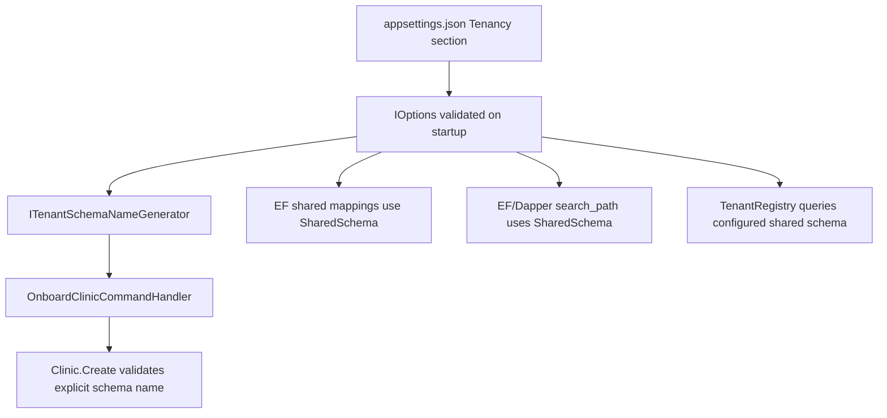

# Tenant Options And Infrastructure Fixes Since Last Commit

This note explains the tenancy infrastructure review fixes made after the last commit. Read it as a teaching document: the goal is not only to remember which files changed, but to understand why the original shape was risky and how the new shape moves the code toward production-grade tenancy.

The short version: we turned tenancy configuration from a set of mostly decorative values into real runtime inputs, then cleaned up the Options pattern and dependency injection so those inputs are validated and consumed consistently.

## The Problems We Solved

| Problem | Why It Mattered | Main Fix |
|---|---|---|
| `SharedSchema` and `TenantSchemaPrefix` were configured but ignored | The app looked configurable while still silently using `shared` and `tenant_` in code | Runtime paths now read `TenancyOptions` |
| The domain generated schema names with a hardcoded prefix | Domain should not know infrastructure configuration | Schema name generation moved behind `ITenantSchemaNameGenerator` |
| EF model mapping used a configurable schema but EF model caching did not know that | EF could reuse a model built for the wrong schema | Added a tenancy-aware EF model cache key |
| `TenancyOptions` carried a database connection string | The connection string is persistence configuration, not tenancy configuration | Removed it from `TenancyOptions` |
| Options were registered both through `IOptions<T>` and as a raw singleton | This created two ways to consume config and encouraged bypassing the Options pattern | Consumers now use `IOptions<TenancyOptions>` |
| Services were manually constructed with `new` in DI | Manual factories hid dependency shape and made lifetime decisions harder to review | Services now use constructor injection directly |
| Raw connection strings were passed into infrastructure services | Primitive constructor args made DI awkward and scattered database setup | Infrastructure services now use `NpgsqlDataSource` |
| Tenancy options had no startup validation | Bad schema names or cache values would fail deep in request handling | Added DataAnnotations and `ValidateOnStart()` |

## The Most Important Lesson

A configuration object is only useful if the program actually reads it on the paths that matter.

Before this fix, `appsettings.json` could say:

```json
{
  "Tenancy": {
    "SharedSchema": "registry",
    "TenantSchemaPrefix": "clinic_"
  }
}
```

But important code paths still behaved as if the values were:

```text
SharedSchema = shared
TenantSchemaPrefix = tenant_
```

That is worse than having no configuration at all. It creates a validated-looking lie: the app exposes knobs that operators believe work, while runtime behavior quietly ignores them.

In tenancy code, that is especially dangerous because schema names are not cosmetic. They decide where data lives and which tables a request can see.

## Fix 1: `TenantSchemaPrefix` Became Real

### Before

[Clinic.cs](../../src/CliniKey.Domain/Entities/Clinic.cs) generated both the clinic ID and schema name internally:

```csharp
var id = Guid.NewGuid();
var schemaName = $"tenant_{id:N}";
```

That meant `TenantSchemaPrefix` could never truly work. Even if infrastructure options said `clinic_`, the domain would still produce `tenant_<guid>`.

### Why This Was Architecturally Awkward

The domain should enforce invariants, not read deployment configuration.

It is fine for [Clinic.cs](../../src/CliniKey.Domain/Entities/Clinic.cs) to say:

- schema names must be valid PostgreSQL identifiers
- schema names must be immutable
- schema names must not exceed the database identifier length

It is not ideal for the domain to decide:

- the configured tenant schema prefix
- how infrastructure reads appsettings
- how the database naming convention is deployed in one environment versus another

Those are application/infrastructure concerns.

### After

The domain creation method now accepts an explicit ID and schema name:

[Clinic.cs](../../src/CliniKey.Domain/Entities/Clinic.cs)

```csharp
public static Result<Clinic> Create(
    Guid id,
    string name,
    string phone,
    string address,
    string schemaName,
    TimeProvider clock)
```

The onboarding handler now orchestrates the ID and schema name:

[OnboardClinicCommandHandler.cs](../../src/CliniKey.Application/Features/Tenants/Commands/OnboardClinic/OnboardClinicCommandHandler.cs)

```csharp
var clinicId = Guid.NewGuid();
var schemaName = _tenantSchemaNameGenerator.Generate(clinicId);
var clinicResult = Clinic.Create(clinicId, request.Name, request.Phone, request.Address, schemaName, _clock);
```

The generator is an Application abstraction:

[ITenantSchemaNameGenerator.cs](../../src/CliniKey.Application/Abstractions/Tenancy/ITenantSchemaNameGenerator.cs)

Infrastructure implements it from `TenancyOptions`:

[TenantSchemaNameGenerator.cs](../../src/CliniKey.Infrastructure/Persistence/TenantSchemaNameGenerator.cs)

```csharp
return $"{_options.TenantSchemaPrefix}{tenantId:N}";
```

### What A Junior Developer Should Notice

This is a good Clean Architecture move. The domain still protects the invariant by validating the final schema name. But the policy for constructing that name moved outward, where configuration belongs.

The pattern is:

```text
Infrastructure config -> Application abstraction -> Domain receives explicit value -> Domain validates invariant
```

That is healthier than:

```text
Domain secretly hardcodes infrastructure naming convention
```

## Fix 2: `SharedSchema` Became Real Across Runtime Paths

### Before

Several runtime paths hardcoded `shared`:

- tenant registry Dapper SQL in [TenantRegistry.cs](../../src/CliniKey.Infrastructure/Persistence/TenantRegistry.cs)
- EF search path setup in [TenantConnectionInterceptor.cs](../../src/CliniKey.Infrastructure/Persistence/TenantConnectionInterceptor.cs)
- Dapper tenant connections in [DbConnectionFactory.cs](../../src/CliniKey.Infrastructure/Persistence/DbConnectionFactory.cs)
- EF shared table mapping in [AppDbContext.cs](../../src/CliniKey.Infrastructure/Persistence/AppDbContext.cs)
- shared context mappings in [SharedDbContext.cs](../../src/CliniKey.Infrastructure/Persistence/SharedDbContext.cs)
- entity configuration classes such as [ClinicConfiguration.cs](../../src/CliniKey.Infrastructure/Persistence/Configurations/ClinicConfiguration.cs)

That meant `SharedSchema` was not a trustworthy option.

### After

The runtime paths now use `TenancyOptions.SharedSchema`.

The tenant registry quotes the configured schema before embedding it into SQL:

[TenantRegistry.cs](../../src/CliniKey.Infrastructure/Persistence/TenantRegistry.cs)

```csharp
var sharedSchema = PostgresIdentifier.QuoteSchema(_options.SharedSchema);
...
FROM {sharedSchema}.clinics
```

The EF connection interceptor now sets the search path with the configured shared schema:

[TenantConnectionInterceptor.cs](../../src/CliniKey.Infrastructure/Persistence/TenantConnectionInterceptor.cs)

```csharp
SET search_path TO "{tenant_schema}", "{shared_schema}", public;
```

The Dapper tenant connection factory does the same:

[DbConnectionFactory.cs](../../src/CliniKey.Infrastructure/Persistence/DbConnectionFactory.cs)

The shared entity mappings now accept a schema parameter:

- [ClinicConfiguration.cs](../../src/CliniKey.Infrastructure/Persistence/Configurations/ClinicConfiguration.cs)
- [DentistConfiguration.cs](../../src/CliniKey.Infrastructure/Persistence/Configurations/DentistConfiguration.cs)
- [ClinicDentistConfiguration.cs](../../src/CliniKey.Infrastructure/Persistence/Configurations/ClinicDentistConfiguration.cs)
- [TenantProvisioningAuditLogConfiguration.cs](../../src/CliniKey.Infrastructure/Persistence/Configurations/TenantProvisioningAuditLogConfiguration.cs)

And the DbContexts pass the configured schema into those mappings:

- [AppDbContext.cs](../../src/CliniKey.Infrastructure/Persistence/AppDbContext.cs)
- [SharedDbContext.cs](../../src/CliniKey.Infrastructure/Persistence/SharedDbContext.cs)

### Why We Also Touched EF Mapping

It would not have been enough to fix only the raw SQL and search path. EF mappings also decide where tables live.

For cross-tenant entities like `Clinic`, `Dentist`, `ClinicDentist`, and `TenantProvisioningAuditLog`, explicit schema mapping is part of tenant safety. These entities must stay in the shared/control-plane schema regardless of the current tenant schema.

If `TenantRegistry` used `registry.clinics` but EF still mapped `Clinic` to `shared.clinics`, the app would split its control plane in half. Some code would read one schema, other code would write another. That is the kind of bug that looks fine in a happy-path test and becomes miserable in production.

## Fix 3: EF Model Caching Had To Learn About The Schema

This is the subtle fix most juniors miss.

EF Core caches the model for a DbContext type. That is usually good. Building a model is expensive, and most apps have one fixed model.

But now our model can depend on options:

```text
AppDbContext + SharedSchema = shared
AppDbContext + SharedSchema = registry
```

Those are not the same model. If EF only keys the cache by context type, it can reuse the model built for `shared` even when the app asks for `registry`.

### The Fix

We added [TenancyModelCacheKeyFactory.cs](../../src/CliniKey.Infrastructure/Persistence/TenancyModelCacheKeyFactory.cs).

It includes the schema values in the model cache key:

```csharp
AppDbContext appDbContext => (context.GetType(), appDbContext.SharedSchema, designTime)
```

And `SharedDbContext` includes both:

```csharp
SharedSchema
TenantSchemaPrefix
```

The contexts replace EF's default model cache key factory:

- [AppDbContext.cs](../../src/CliniKey.Infrastructure/Persistence/AppDbContext.cs)
- [SharedDbContext.cs](../../src/CliniKey.Infrastructure/Persistence/SharedDbContext.cs)

### Why This Matters

This is a great example of senior-level infrastructure thinking. Once you make metadata configurable, you must ask:

```text
Who caches the old metadata?
```

In EF Core, the answer is the model cache.

## Fix 4: `TenancyOptions` Became A Real Options Type

### Before

[TenancyOptions.cs](../../src/CliniKey.Infrastructure/Persistence/TenancyOptions.cs) had no validation and included a connection string:

```csharp
public string ConnectionString { get; set; } = string.Empty;
```

Then [DependencyInjection.cs](../../src/CliniKey.Infrastructure/DependencyInjection.cs) used `PostConfigure` to stamp the database connection string into tenancy options.

That was technically legal, but conceptually muddy.

### Why The Connection String Did Not Belong There

`TenancyOptions` should describe tenancy behavior:

- what shared schema is called
- what tenant schema prefix to use
- how long registry entries are cached
- which advisory lock key to use
- whether tenant migrations run on startup

The database connection string is persistence configuration. It applies to auth, shared context, tenant migrations, Dapper, EF, and more. It is not specifically a tenancy rule.

Putting it inside `TenancyOptions` created a confused object:

```text
TenancyOptions = tenancy rules + database connectivity
```

That makes every consumer ask: am I using this because I need tenancy behavior, or because I need a database connection?

### After

`ConnectionString` was removed from [TenancyOptions.cs](../../src/CliniKey.Infrastructure/Persistence/TenancyOptions.cs).

The options now focus on tenancy:

```csharp
public string SharedSchema { get; set; } = DefaultSharedSchema;
public string TenantSchemaPrefix { get; set; } = DefaultTenantSchemaPrefix;
public int TenantRegistryCacheSeconds { get; set; } = 30;
public long ProvisioningLockKey { get; set; } = 3003;
public bool RunTenantMigrationsOnStartup { get; set; }
```

And it now has DataAnnotations validation:

- `SharedSchema`: required, max 63, valid PostgreSQL identifier shape
- `TenantSchemaPrefix`: required, max 31, valid PostgreSQL identifier shape
- `TenantRegistryCacheSeconds`: 1 to 3600
- `ProvisioningLockKey`: positive long

### Why `TenantSchemaPrefix` Max Length Is 31

PostgreSQL identifiers max out at 63 bytes. This schema generator appends a 32-character GUID string:

```text
prefix + tenantId:N
```

So the prefix cannot be longer than:

```text
63 - 32 = 31
```

That is not random validation. It encodes the downstream database constraint into startup validation.

## Fix 5: `ValidateOnStart()` Catches Bad Config Early

Before this change, bad config could survive startup and fail later during:

- first tenant request
- first tenant provisioning
- first schema migration
- first EF model creation

Now [DependencyInjection.cs](../../src/CliniKey.Infrastructure/DependencyInjection.cs) registers tenancy options like this:

```csharp
services
    .AddOptions<TenancyOptions>()
    .Bind(configuration.GetSection(TenancyOptions.SectionName))
    .ValidateDataAnnotations()
    .ValidateOnStart();
```

That means invalid tenancy config fails during app startup, before traffic reaches the API.

For infrastructure settings that affect SQL identifiers, startup failure is a gift. It is much easier to fix:

```text
App failed to start because SharedSchema was invalid
```

than:

```text
Some tenant requests fail with SQL errors after deployment
```

## Fix 6: Removed The Raw `TenancyOptions` Singleton

### Before

DI registered both:

```text
IOptions<TenancyOptions>
TenancyOptions
```

The raw object was registered like:

```csharp
services.AddSingleton(sp => sp.GetRequiredService<IOptions<TenancyOptions>>().Value);
```

Then some services consumed the raw `TenancyOptions`.

### Why This Was A Smell

The Options pattern gives you one conventional way to consume config:

```csharp
IOptions<T>
```

When you also register `T` directly, you create two config paths:

```text
Path A: IOptions<TenancyOptions>
Path B: TenancyOptions
```

That makes code review harder because now a reviewer must check whether each consumer is using the framework wrapper or a raw snapshot. It also encourages future code to bypass validation/reload semantics by accident.

### After

Infrastructure consumers take `IOptions<TenancyOptions>` directly:

- [TenantRegistry.cs](../../src/CliniKey.Infrastructure/Persistence/TenantRegistry.cs)
- [TenantMigrationService.cs](../../src/CliniKey.Infrastructure/Persistence/TenantMigrationService.cs)
- [TenantProvisioningService.cs](../../src/CliniKey.Infrastructure/Persistence/TenantProvisioningService.cs)
- [TenantConnectionInterceptor.cs](../../src/CliniKey.Infrastructure/Persistence/TenantConnectionInterceptor.cs)
- [DbConnectionFactory.cs](../../src/CliniKey.Infrastructure/Persistence/DbConnectionFactory.cs)
- [TenantSchemaNameGenerator.cs](../../src/CliniKey.Infrastructure/Persistence/TenantSchemaNameGenerator.cs)

The code now has one clear config path.

## Fix 7: Replaced Raw Connection Strings With `NpgsqlDataSource`

### Before

Several infrastructure services accepted a raw `string connectionString`.

That caused two practical problems:

1. DI had to manually construct the services because primitive strings are ambiguous.
2. Database connection setup was scattered across constructors and factories.

### After

[DependencyInjection.cs](../../src/CliniKey.Infrastructure/DependencyInjection.cs) creates one singleton `NpgsqlDataSource`:

```csharp
services.AddSingleton(_ => NpgsqlDataSource.Create(connectionString));
```

EF contexts use that data source:

```csharp
options.UseNpgsql(sp.GetRequiredService<NpgsqlDataSource>())
```

And infrastructure services consume it:

- [TenantRegistry.cs](../../src/CliniKey.Infrastructure/Persistence/TenantRegistry.cs)
- [TenantMigrationService.cs](../../src/CliniKey.Infrastructure/Persistence/TenantMigrationService.cs)
- [TenantProvisioningService.cs](../../src/CliniKey.Infrastructure/Persistence/TenantProvisioningService.cs)
- [DbConnectionFactory.cs](../../src/CliniKey.Infrastructure/Persistence/DbConnectionFactory.cs)

### Why This Is Better

`NpgsqlDataSource` is a typed database access abstraction. It makes the dependency graph more explicit:

```text
TenantRegistry needs PostgreSQL access
```

instead of:

```text
TenantRegistry needs some string that happens to be a connection string
```

This also lets DI construct services normally. The constructors say what the services need, and DI can provide those dependencies without custom factories.

## Fix 8: DI Became More Honest

### Before

Tenant services were registered with manual factories:

```csharp
services.AddScoped<ITenantRegistry>(sp => new TenantRegistry(...));
services.AddScoped<ITenantMigrationService>(sp => new TenantMigrationService(...));
services.AddScoped<ITenantProvisioningService>(sp => new TenantProvisioningService(...));
```

Manual factories are not always bad. Sometimes they are the cleanest way to pass runtime values. But in this case, they were mostly compensating for awkward constructors:

- raw connection string
- raw options singleton
- inconsistent options usage

### After

[DependencyInjection.cs](../../src/CliniKey.Infrastructure/DependencyInjection.cs) can register implementations directly:

```csharp
services.AddSingleton<ITenantSchemaNameGenerator, TenantSchemaNameGenerator>();
services.AddSingleton<ITenantRegistry, TenantRegistry>();
services.AddSingleton<ITenantMigrationService, TenantMigrationService>();
services.AddScoped<ITenantProvisioningService, TenantProvisioningService>();
services.AddScoped<IDbConnectionFactory, DbConnectionFactory>();
```

### Why These Lifetimes Make Sense

`ITenantRegistry` is singleton because it depends on:

- `NpgsqlDataSource`, a singleton database access object
- `IMemoryCache`, a singleton cache
- `IOptions<TenancyOptions>`, stable configuration

`ITenantMigrationService` is singleton for similar reasons.

`ITenantProvisioningService` stays scoped because it depends on [SharedDbContext.cs](../../src/CliniKey.Infrastructure/Persistence/SharedDbContext.cs), and DbContexts are scoped.

This is a useful lifetime rule:

```text
A service can be singleton only if all of its dependencies are singleton-safe.
```

## What Changed In Tests

The tests changed mostly because the constructors became more honest.

For example, integration tests now create an `NpgsqlDataSource` and pass `Options.Create(new TenancyOptions())` when manually constructing infrastructure services:

- [TenantMigrationServiceTests.cs](../../tests/CliniKey.Tests/Infrastructure/TenantMigrationServiceTests.cs)
- [TenantDapperConnectionTests.cs](../../tests/CliniKey.Tests/Infrastructure/TenantDapperConnectionTests.cs)
- [TenantProvisioningIntegrationTests.cs](../../tests/CliniKey.Tests/Infrastructure/TenantProvisioningIntegrationTests.cs)
- [TenantLifecycleAccessTests.cs](../../tests/CliniKey.Tests/Infrastructure/TenantLifecycleAccessTests.cs)

The most important new regression tests are in [SharedSchemaMappingTests.cs](../../tests/CliniKey.Tests/Infrastructure/SharedSchemaMappingTests.cs):

- one test proves EF maps shared entities to a configured shared schema
- one test proves `TenantSchemaNameGenerator` uses the configured tenant prefix

Those tests are intentionally small. They guard against the exact bug we fixed: config exists but runtime behavior ignores it.

## The Flow After The Fix



The key point is that `TenancyOptions` now feeds every place where the values matter.

## What We Did Not Solve Yet

This slice intentionally did not solve every review item. The remaining important issues are:

1. `TenantRegistry` still uses `Enum.Parse` on database strings. It should move to `Enum.TryParse` and return a controlled failure.
2. Tenant registry cache misses still have no stampede protection.
3. `IMemoryCache` invalidation is still local to one app instance. Multi-node deployments can still see stale active/inactive tenant state until TTL expiry.
4. `TenancyOptions` remains public for now because public DbContext constructors accept `IOptions<TenancyOptions>`. Making it internal cleanly needs a constructor/API shape adjustment.
5. Advisory lock naming is still a little muddy: `ProvisioningLockKey` is also used for migration locking.

Those are separate follow-up slices. The important thing is that the foundation is no longer lying: config values now drive behavior.

## Verification Performed

These commands passed after the changes:

```powershell
dotnet build E:\CliniKey\CliniKey.slnx --no-restore
```

```powershell
dotnet test E:\CliniKey\tests\CliniKey.Tests\CliniKey.Tests.csproj --no-build --filter "Category!=Integration"
```

The fast test run reported 157 passing tests.

Integration tests were updated to the new constructor shapes, but the full container-backed integration suite was not run in this slice.

## How To Study This Change

Read it in this order:

1. Start with [TenancyOptions.cs](../../src/CliniKey.Infrastructure/Persistence/TenancyOptions.cs). Ask: what values are now considered valid at startup?
2. Read [DependencyInjection.cs](../../src/CliniKey.Infrastructure/DependencyInjection.cs). Ask: how does configuration become validated options, and how does database access become `NpgsqlDataSource`?
3. Read [ITenantSchemaNameGenerator.cs](../../src/CliniKey.Application/Abstractions/Tenancy/ITenantSchemaNameGenerator.cs), then [TenantSchemaNameGenerator.cs](../../src/CliniKey.Infrastructure/Persistence/TenantSchemaNameGenerator.cs). Ask: why is the interface in Application and implementation in Infrastructure?
4. Read [OnboardClinicCommandHandler.cs](../../src/CliniKey.Application/Features/Tenants/Commands/OnboardClinic/OnboardClinicCommandHandler.cs), then [Clinic.cs](../../src/CliniKey.Domain/Entities/Clinic.cs). Ask: what does the handler decide, and what does the domain validate?
5. Read [AppDbContext.cs](../../src/CliniKey.Infrastructure/Persistence/AppDbContext.cs), [SharedDbContext.cs](../../src/CliniKey.Infrastructure/Persistence/SharedDbContext.cs), and [TenancyModelCacheKeyFactory.cs](../../src/CliniKey.Infrastructure/Persistence/TenancyModelCacheKeyFactory.cs). Ask: why does configurable model metadata need a custom model cache key?
6. Read [TenantConnectionInterceptor.cs](../../src/CliniKey.Infrastructure/Persistence/TenantConnectionInterceptor.cs), [DbConnectionFactory.cs](../../src/CliniKey.Infrastructure/Persistence/DbConnectionFactory.cs), and [TenantRegistry.cs](../../src/CliniKey.Infrastructure/Persistence/TenantRegistry.cs). Ask: where does `SharedSchema` affect runtime SQL?
7. Finish with [SharedSchemaMappingTests.cs](../../tests/CliniKey.Tests/Infrastructure/SharedSchemaMappingTests.cs). Ask: what exact regression would these tests catch?

## Mini Exercises

1. Change `TenantSchemaPrefix` to `clinic_` in a test. Predict the generated schema name before running it.
2. Change `SharedSchema` to `registry` in a test. Predict which EF entities should map to `registry`.
3. Explain why `TenantProvisioningService` cannot be singleton while `TenantRegistry` can.
4. Explain why `NpgsqlDataSource` is better than passing a raw connection string into every service.
5. Explain what would break if we removed [TenancyModelCacheKeyFactory.cs](../../src/CliniKey.Infrastructure/Persistence/TenancyModelCacheKeyFactory.cs).

## Senior Review Checklist For Future Work

When reviewing future tenancy changes, ask these questions:

- If a value is configurable, is every runtime path actually reading it?
- If schema/table metadata is configurable, does EF model caching account for it?
- Does the domain validate invariants without reading infrastructure configuration?
- Are options consumed through `IOptions<T>` consistently?
- Does `ValidateOnStart()` catch bad deployment config before traffic arrives?
- Are singleton services free from scoped dependencies?
- Are SQL identifiers validated and quoted before use?
- Are tests proving behavior, or only proving default values?

The theme is simple: tenancy code must be boringly explicit. Hidden defaults and half-wired configuration are where data isolation bugs are born.
